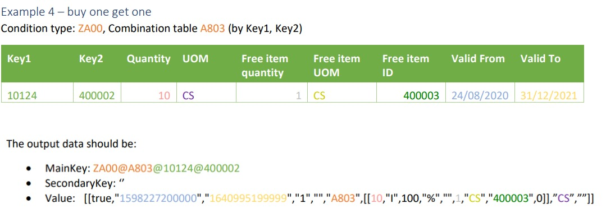

# General Setup

## Preparation to setup

Before you start working with the PPM add-on, you need to install it along with any additional required add-ons to your environment. To do this, use Postman and the following POST API requests:


PPM add-on



ATD Events add-on



Scripts add-on



Flows add-on



If you want to use UOM (Unit of Measure) for PPM, install the UOM add-on and configure it for your transaction.


Refer to [this article](../uom-add-on-module.md) to set up the add-on correctly.



UOM add-on


***

### To use the pricing module in a transaction, you need to complete the following steps:

1. Set Up UDC Tables for PPM Module Settings
2. Create PPM config JSON and upload it into UDC
3. Define the procedure that will run for transaction.
4. Define additional fields in transaction.
5. Call the pricing logic using ATD events.
6. Upload pricing data

***

### 1. Set Up UDC Tables for PPM Module Settings

1. **Navigate to Configuration -> User Defined Collections.**
2. **Create two tables that will contain settings for the PPM module.**

**First Table: "PricingConfig"**

This table will store all configuration JSON files for PPM.

<figure><figcaption><p>"Add collection" window</p></figcaption></figure>

In the next window:

* Change the **"Data Storage & Sync"** parameter to **"Available for online and offline."**
* Add a new field named **"schema"** with the type **"String."**

<div data-full-width="false"><figure><figcaption><p>"Add field" window</p></figcaption></figure></div>

Final Look of the "PricingConfig" Table:

<figure><figcaption><p>Final look of "PricingConfig" table</p></figcaption></figure>

**Second Table: "PricingATD"**

This table will store the **UUID** of the transaction to which PPM will be applied, as well as the **procedure name** from the config file.

<figure><figcaption><p>"Add collection" window</p></figcaption></figure>

In the next window:

* Change the **"Data Storage & Sync"** parameter to **"Available for online and offline."**
* Add a new field named **"procedure"** with the type **"String."**

<figure><figcaption><p>"procedure" field settings</p></figcaption></figure>

Final Look of the "PricingATD" Table:

<figure><figcaption><p>Final look of "PricingATD" table</p></figcaption></figure>

**Third Table: "PricingGeneral"**

This table will store pricing data if you decide to use UDC for this purpose.

<figure><figcaption><p>"Add collection" window</p></figcaption></figure>

In the next window:

* Change the **"Data Storage & Sync"** parameter to **"Available for online and offline."**

<figure><figcaption><p><strong>Final Look of the "PricingGeneral" Table</strong></p></figcaption></figure>


Don’t forget to publish these collections!


***

### 2. Create PPM config JSON and upload it into UDC

The configuration JSON consists of four main blocks:

* **PPM\_General**
* **PPM\_CalcProcedures**
* **PPM\_Conditions**
* **PPM\_Tables**

Let’s examine each block separately.

#### **PPM\_General**

This block contains general settings for the pricing logic. Below is an example of how this section looks:


```json
{
  "PPM_General": {
    "QuantityCriteriaField": "UnitsQuantity",
    "TotalPriceCriteria": {
      "Type": "Block",
      "Name": "Base"
    },
    "CalcDateField": "TransactionTSADeliveryDateForPricing",
    "MultipleValuesKeyFields": [
      "TransactionTSAAccountContr",
      "TransactionTSAAccountHierarchy"
    ],
    "PriceRoundPrecision": 4,
    "UOM": {
      "ConfigurationField": "ItemTSAItemUOMConfig",
      "AllowedUomsField": "TSAAllowedUOMs",
      "Fields": [
        {
          "Type": "TSAAOQMUOM1",
          "Quantity": "TSAAOQMQuantity1"
        }
      ]
    },
    "UDC": ["PricingGeneral", "PricingCompany", "PricingCompanyParent"]
  }
}
```


* **QuantityCriteriaField** - The field which holds the total quantity in singles for quantity tier discounts.
* **PriceCriteriaField** - The field which holds the total priсe in singles for quantity tier discounts.
* **TotalPriceCriteria** - Object referring to a field or a block which holds the total price for price tier discounts.
  * **Type -** Block or Field
  * **Name -** Name of Block or Field
* **CalcDateField** - _Optional._ The date field to check the pricing validity. If not specified, then current date will be used.
* **MultipleValuesKeyFields** - _Optional._ A list of fields which contain multiple values, such as list of contracts. While checking for a pricing rule, a check will be done to each of the values in these fields.
* **PriceRoundPrecision -** _Optional(default value - 4)._ Round of discount value to add/reduce/set and of values in the applied rules message
* **UOM -** _Optional._ When working with the UOM module: Object with the UOM configurations
  * **ConfigurationField -** The field which contains the UOM configuration (such as factors per item). The field will be in the format of \[{“UOMKey”:uom, “Factor”:factor},{...}]
  * **AllowedUomsField -** The field which contains the allowed UOMs per item (such as \["CS,EA"]). The field will be in the format of \["key1", "key2",...]
  * **Fields -** Array of uom Type and Quantity fields
* **UDC -** _Optional._ When working with UDCs: Array of the Pricing UDCs.

#### **PPM\_CalcProcedures**

In this section, you define all the procedures required to calculate the price for items. You can include as many procedures as needed, each with its own unique calculation logic.

You can add as many procedures as necessary, tailoring each one to your specific pricing logic.

Here’s an example of how this part might look:


```json
{
  "PPM_CalcProcedures": [
    {
      "Key": "Proc1",
      "Blocks": [
        {
          "Key": "Base",
          "ConditionsOrder": ["ZCEF"],
          "InitialPrice": {
            "Type": "Field",
            "Name": "UnitPrice"
          },
          "CalculatedOfPrice": {
            "Type": "Field",
            "Name": "UnitPrice"
          }
        },
        {
          "Key": "Quantity",
          "Group": true,
          "ConditionsOrder": ["ZKR3", "ZKF3"],
          "InitialPrice": {
            "Type": "Block",
            "Name": "Base"
          },
          "CalculatedOfPrice": {
            "Type": "Block",
            "Name": "Base"
          }
        },
        {
          "Key": "ManualLine",
          "ConditionsOrder": [],
          "InitialPrice": {
            "Type": "Block",
            "Name": "Quantity"
          },
          "CalculatedOfPrice": {
            "Type": "Block",
            "Name": "Quantity"
          },
          "UserManual": {
            "ValueField": "TSAUserLineDiscount"
          }
        },
        {
          "Key": "SFAPromo",
          "ConditionsOrder": [],
          "InitialPrice": {
            "Type": "Block",
            "Name": "ManualLine"
          },
          "CalculatedOfPrice": {
            "Type": "Block",
            "Name": "ManualLine"
          },
          "UserManual": {
            "ValueField": "TSAPromoLineDiscount",
            "NameField": "TSAPromoLineDiscountName",
            "TypeField": "TSAPromoLineDiscountType"
          }
        },
        {
          "Key": "Tax",
          "ConditionsOrder": ["MWST"],
          "InitialPrice": {
            "Type": "Block",
            "Name": "SFAPromo"
          },
          "CalculatedOfPrice": {
            "Type": "Block",
            "Name": "SFAPromo"
          }
        }
      ],
      "ExclusionRules": [
        {
          "Condition": "ZKF1",
          "ExcludeConditions": ["ZKF8", "ZKR8"]
        },
        {
          "Condition": "ZKR1",
          "ExcludeConditions": ["ZKF8", "ZKR8"]
        }
      ],
      "CalculatedItemFields": [
        {
          "Name": "TSAPPMBaseUnitPriceAfter1",
          "Type": "=",
          "Operand1": {
            "Type": "Block",
            "Name": "Base"
          },
          "BlockPriceField": {
            "Type": "Single",
            "UomIndex": 1
          }
        },
        {
          "Name": "TSAPPMBaseTotalPriceAfter",
          "Type": "=",
          "Operand1": {
            "Type": "Block",
            "Name": "Base"
          },
          "BlockPriceField": {
            "Type": "Total"
          }
        },
        {
          "Name": "TSADiscountAmount",
          "Type": "-",
          "Operand1": {
            "Type": "Block",
            "Name": "Cash"
          },
          "Operand2": {
            "Type": "Block",
            "Name": "ManualOrder"
          },
          "BlockPriceField": {
            "Type": "Total"
          }
        }
      ],
      "AdditionalItemPricing": {
        "BasedOnBlock": "Base",
        "ContinueCalcFromBlock": "Tax"
      }
    }
  ]
}
```


* **Key -** Procedure key. This key used to assign procedure to transaction
* **Blocks -** Array of pricing blocks. It will executed one after another. So it's important the order of these blocks.
  * **Key -** Block unique identifier
  * **ConditionsOrder -** The pricing conditions that will be checked when calculating the block. Order is important. Can be empty array for manual discount
  * **InitialPrice -** Object referring to a field or a block. The discount will be reduced from this value
  * **CalculatedOfPrice -** Object referring to a field or a block. The discount will be calculated on this value
  * **Group -** _Optional (default=false)_. Defines if all the items which answer the condition should be counted together to get group discount.
  * **UserManual -** _Optional._ An object with the fields that hold the discount data (TypeField, NameField, ValueField) for manual discount or package promotion discount.
* **ExclusionRules -** Object representing the conditions which should be excluded if a condition is applied.
  * **Condition -** Condition key. Condition in which exclusion rules will be apply.
  * **ExcludeConditions -** Array of condition keys that will not be applied
* **CalculatedItemFields -** Array of output fields
  * **Name -** Field name
  * **Type -** Operator (=, -, %)
  * **Operand1 -** Object referring to a field or a block.
    * **Type -** Block or Field
    * **Name -** Name of Block or Field
  * **Operand2 -** _Optional._ Object referring to a field or a block. Used when the type is ‘–‘ or ‘%’, and then will return operand1-operand2.
    * **Type -** Block or Field
    * **Name -** Name of Block or Field
  * **BlockPriceField -** is used to define how block prices are calculated and applied.&#x20;
    * There are different block types to support various pricing scenarios:
      * **Single Type**:
        * Calculates a **single value** from the block price result.
        * **Important**: <mark style="color:$warning;">If you use UOM in your configuration</mark>, define the **UomIndex** (from the list of allowed UOMs) to ensure accurate calculations.
      * **Total Type**:
        * Calculates the total value for all items by multiplying the block price result by the quantities.
      * **Unit Type**:
        * Allows pricing calculations to work correctly with the **UOM add-on**.
        * **Important**: <mark style="color:$warning;">If you use UOM in your configuration</mark>, define the **UomIndex** (from the list of allowed UOMs) to ensure accurate calculations.
* **AdditionalItemPricing -** For additional items given by discount
  * **BasedOnBlock -** The price on which additional item discount will be applied on
  * **ContinueCalcFromBlock -** Additional rules which should be applied on the additional item

**PPM\_Conditions**

In this section, you define all the conditions that were described in the **PPM\_CalcProcedures** part. These conditions determine when and how specific pricing procedures should be applied.

Here’s an example of how this part might look:


```json
{
  "PPM_Conditions": [
    {
      "Key": "MWST",
      "Name": "MWST",
      "TablesSearchOrder": ["A002"]
    },
    {
      "Key": "ZKR4",
      "Name": "ZKR4",
      "TablesSearchOrder": [
        "A004",
        "A715",
        "A850",
        "A717",
        "A948",
        "A707",
        "A949",
        "A844",
        "A843"
      ]
    },
    {
      "Key": "ZCEF",
      "Name": "ZCEF",
      "TablesSearchOrder": ["A715", "A707", "A844"]
    },
    {
      "Key": "ZPR0",
      "Name": "ZPR0",
      "TablesSearchOrder": [
        "A505",
        {
          "Name": "A505",
          "Keys": [
            {
              "Name": "TransactionAccountTSAPriceLevelCode",
              "Value": "01"
            }
          ]
        }
      ]
    },
    {
      "Key": "ZCD1",
      "Name": "ZCD1",
      "TablesSearchOrder": [
        "A305",
        {
          "Name": "A600"
        },
        {
          "Name": "A600",
          "Keys": [
            {
              "Name": "ItemTSAProdHierarchy",
              "Split": 11
            }
          ]
        },
        {
          "Name": "A600",
          "Keys": [
            {
              "Name": "ItemTSAProdHierarchy",
              "Split": 8
            }
          ]
        },
        {
          "Name": "A600",
          "Keys": [
            {
              "Name": "ItemTSAProdHierarchy",
              "Split": 5
            }
          ]
        },
        {
          "Name": "A600",
          "Keys": [
            {
              "Name": "ItemTSAProdHierarchy",
              "Split": 2
            }
          ]
        }
      ]
    }
  ]
}
```


* **Key** - Condition unique identifier
* **Name** - Descriptive name
* **TablesSearchOrder** - The tables that will be checked when calculating the condition. Order is important.&#x20;
  * Optional - Can contain an object with:&#x20;
    * &#x20;Split – number of characters to take from the field&#x20;
    * Value - override field value. When used, the table should be defined twice, so first the field value will be searched and then the constant value will be searched.&#x20;
      *   **Use case:** if the account price level is not found, use 01. This is defined as:

          `"TablesSearchOrder": ["A505", {"Name": "A505", "Keys": [{"Name": "TransactionAccountTSAPriceLevelCode", "Value": "01"}]}]`

**PPM\_Tables**

In this section, you define all the tables and keys where the system will look for values required for pricing calculations. This part ensures that the pricing logic can access the necessary data from the correct sources.

Here’s an example of how this part might look:


```json
{
    "PPM_Tables": [
        {
            "Key": "A997",
            "KeyFields": [
                "TransactionTSACompany",
                "ItemExternalID"
            ]
        },
        {
            "Key": "A996",
            "KeyFields": [
                "TransactionTSACompany",
                "TransactionTSADivision",
                "TransactionTSAPlant",
                "TransactionAccountTSAParentExID",
                "ItemExternalID"
            ]
        },
        {
            "Key": "A002",
            "KeyFields": [
                "TransactionAccountCountryISOAlpha2Code",
                "TransactionTSATaxClass",
                "TSATaxClass"
            ]
        }
    ]
}
```


Here’s a complete example of a PPM configuration JSON file:



1. After completing the configuration, copy the JSON content.
2. Go to the **PricingConfig** UDC table.
3. Add a new document with the following details:
   * **Key**: Use `"main"` as the key.
   * **Value**: Paste the copied JSON configuration.


## Important!

It is currently impossible to use different config files for different transactions.

All procedures for different transactions placed in one config must contain identical dependency fields.


***

### 3. Define the procedure that will run for transaction.

#### **Step 1: Get the UUID of the Transaction**

1. Navigate to **Sales Activities -> Transaction Types**.
2. Select the transaction type to which you want to apply the PPM logic.
3. Click the **Pen (Edit)** icon, then click **Export**.
4. Open the downloaded JSON file using **VSCode** or any other text editor.
5. Locate and copy the **UUID** of the transaction.


<figure><figcaption></figcaption></figure>

Go to **PricingATD UDC**, add a new document with the following data, and click **Save**.

<figure><figcaption></figcaption></figure>

***

### 4. Define additional fields in transaction.

Go to your transaction and:

* _Create Custom Transaction Field:_
  * **TSAPPMLastUpdate**
    * Type:  **Single Line Text**
* _Create Custom Line Fields:_&#x20;
  * **TSAPPMLastLinePricingUpdate**
    * Type: **Single Line Text**
  * **TSANPMCalcMessage**
    * Type: **Single Line Text**
  * **TSANPMPricingData**
    * Type: **Single Line Text**

***

### 5. Call the pricing logic using ATD events.

The pricing module is called via a pricing block in the transaction events. \
The price calculation can be done on current item, all cart items or cart and order center items.&#x20;

The block should be defined at least in the following events

* **On load** - After transaction scope filter&#x20;
  * Block Scope - **Order center and cart.**
* **On Line field change** (of Units Quantity / UOM Quantity / UOM type fields / manual line discount fields)&#x20;
  * Block Scope - **Current item.**&#x20;
* **On Header field change** (of manual order discount / delivery date)&#x20;
  * Block Scope -  **Order center and cart.**&#x20;
* **User event** (raised from workflow)&#x20;
  * Block Scope - **All cart items.**

#### 1. Create two additional scripts

First, you need to create two additional scripts.\
Log in to the environment using **SupportAdminUser**, then go to **Configuration → Scripts** and add these two scripts.

1. **Calculate Transaction Totals -** updates a header TSA with the current time, in order to trigger a rule engine that calls calc fields to calculate order totals.  (order totals runs in rule engine since they need to be calculated also after package promo is given and the only trigger for it is rule engine on Total Quantities)
   1. **Parameter - transactionUUID -** Type: **String**
2. **Update TSAPPMLastLinePricingUpdate -** updates a line TSA with the current time, in order to trigger a TSAPPIItemPromotionTrigger field.
   1. **Parameter - transactionUUID -** Type: **String**
   2. **Parameter - transactionLineUUID-** Type: **String**


**Calculate Transaction Totals script**



**Update TSAPPMLastLinePricingUpdate script**


<figure><figcaption><p>Adding <strong>Calculate Transaction Totals script</strong></p></figcaption></figure>

<figure><figcaption><p>Adding <strong>Update TSAPPMLastLinePricingUpdate script</strong></p></figcaption></figure>

#### 2. Create flows for transaction

Go to **Configuration → Flows** and create the following new flows:

* **Transaction Load** - flow will trigger calculation price and transaction total
  1. General:
     1. Name: **Transaction Load**
     2. Descriptio&#x6E;**: Flow on transaction load**
  2. Parameters:&#x20;
     1. **transactionUUID**
        1. Key: **transactionUUID**
        2. Description: UUID of Transaction
        3. Type: String
  3. Steps:
     1. Drag "**Calculate Price**" block to "Used Logic Blocks"
        1. Scope: **Order center and cart**
     2. Drag "**UserScriptsBlock**" block to "Used Logic Blocks"
        1. Select **"Calculate Transaction Totals"** script
        2. Parameters: **transactionUUID** - **Dynamic** - Select **transactionUUID** from dropdown

Click **Update**, then select the flow from the list. Click **Edit → Publish**.

* **Line Change** - this flow will trigger price and total recalculation after one of dependent fields is changed
  1. General:
     1. Name: **Line Change**
     2. Descriptio&#x6E;**: Flow on transaction line field change**
  2. Parameters:&#x20;
     1. **transactionUUID**
        1. Key: **transactionUUID**
        2. Description: **UUID of Transaction**
        3. Type: **String**
     2. **transactionLineUUID**
        1. Key: **transactionLineUUID**
        2. Description: **UUID of Transaction Line**
        3. Type: **String**
  3. Steps:
     1. Drag "**Calculate Price**" block to "Used Logic Blocks"
        1. Scope: **Current Item**
     2. Drag "**UserScriptsBlock**" block to "Used Logic Blocks"
        1. Select **"Calculate Transaction Totals"** script
        2. Parameter: **transactionUUID** - **Dynamic** - Select **transactionUUID** from dropdown
     3. Drag "**UserScriptsBlock**" block to "Used Logic Blocks"
        1. Select **"Update TSAPPMLastLinePricingUpdate"** script
        2. Parameter: **transactionUUID** - **Dynamic** - Select **transactionUUID** from dropdown
        3. Parameter: **transactionLineUUID** - **Dynamic** - Select **transactionLineUUID** from dropdown

Click **Update**, then select the flow from the list. Click **Edit → Publish**.

* **Header change -** this flow will trigger price and total recalculation after one of dependent fields is changed
  * General:
    * Name: **Header change**
    * Descriptio&#x6E;**: Flow on transaction field change**
  * Parameters: &#x20;
    * **transactionUUID**
      1. Key: **transactionUUID**
         1. Description: **UUID of Transaction**
         2. Type: **String**
  * Steps:
    * Drag "**Calculate Price**" block to "Used Logic Blocks"
      * Scope: **All cart items**
    * Drag "**UserScriptsBlock**" block to "Used Logic Blocks"
      1. Select **"Calculate Transaction Totals"** script
      2. Parameter: **transactionUUID** - **Dynamic** - Select **transactionUUID** from dropdown

Click **Update**, then select the flow from the list. Click **Edit → Publish**.

#### 3. Update Events at Transaction

Go to **Sales Activities → Transaction Types**, select your transaction, and open the **Event** tab.

Click **Add** and add the following events for the transaction:

* **Transaction Loaded**
  * Event: **Transaction Loaded**
  * Field: Empty
  * Flow: **Transaction Load**
    * Flow parameters: Dynamic - TransactionUUID

If you have fields that affect pricing, you should recalculate the price whenever one of these fields is changed.&#x20;

To do this, add events for each of these fields.

* **Transaction Field/Line Field Changed** (Depending on field that affect at price)
  * Event: **Transaction Field/Line Field Changed**
  * Field: _(For example)_ **AOQM\_Quantity1**&#x20;
  * Flow: **Line Change**
    * Flow parameter: Dynamic - TransactionUUID
    * Flow parameter: Dynamic - TransactionLineUUID

***

### 6. Upload pricing data

The pricing data can be stored in **user defined tables (UDT)**, **User defined collections (UDC)** or **a** **combination of both**.&#x20;

The decision of the data location depends on the sync requirements:&#x20;

* **User defined tables (UDT)** – sync data to all (such as generic tax data) or sync per account.&#x20;
* **User defined collections (UDC)** – complex sync rules (such as per user division or account parent)&#x20;

For example, the following pricing tables will be placed in different UDT/UDC to improve the sync process:

<figure><figcaption><p>Example of storing pricing data</p></figcaption></figure>

#### User defined tables (UDT)

If some of the pricing data should be synced to all users or if some of the pricing data is defined per the account so it should be synced based on the accounts assigned to the user, then it’s best to use UDT to store the pricing data.

When using UDTs, the data can be stored in the following UDTs:

* **PPM\_Values** – holds data which should be synced to all users (non-account specific data).&#x20;
* **PPM\_AccountValues** – holds the data which is account specific, so only partial data will be synced to the users, based on the accounts assigned to each user.

The data content is as follows:

1. **MainKey** value is a concatenation of the condition type + combination table + combination table values, using <mark style="color:red;">**‘@’**</mark> as a divider. For example, if the condition type is ‘ZPR0’ and the combination table is ‘A9AC’ with fields of ‘Account’+’Material’, then the MainKey will be ‘ZPR0@A9AC@1102658@12343’.
2. **SecondaryKey** value is:&#x20;
   1. **For the PPM\_Values** – blank&#x20;
   2. **For the PPM\_AccountValues** – the account external ID
3. Value is a stringify JSON array with one or more data objects as detailed below.

#### User defined collections (UDC)

If you need complex sync rules for the pricing, such as by the user division or account chain, then it is best to store the data in UDC.&#x20;

A UDC will be defined for each combination of properties which will reduce the number of records synced to the user.&#x20;

A UDC can contain data for several pricing tables.

The UDC contains the following fields:

*   **PricingKey** – value is a concatenation of the condition type + combination table + combination table values, using <mark style="color:red;">**‘@’**</mark> as a divider.&#x20;

    _For example, if the condition type is ‘ZPR0’ and the combination table is ‘A9AC’ with fields of ‘Account’+’Material’, then the MainKey will be ‘ZPR0@A9AC@1102658@12343’._&#x20;

    _(This is the same value as MainKey in the UDT)_&#x20;
*   **PricingData** – value is a stringify JSON array with one or more data objects as detailed below.&#x20;

    _(This is the same value as Value in the UDT)_&#x20;
*   **xxx** – fields which are relevant for the sync. These fields are not used in the pricing logic.&#x20;

    _They are only used to reduce the synced data._

#### Value / PricingData structure

**Value** (in UDT) or **PricingData** (in UDC) is a stringify JSON array with one or more data objects.

_**Note:** usually one data object is used, however multiple objects can be defined in case future prices are required._

Data object Structure:

1. **Enabled** – constant ‘true’
2. **Valid from** – _Optional. Can be left blank (“”)_. Unix format in milliseconds, so ‘1626739200000’ means ‘July 20, 2021, 12:00:00 AM’.&#x20;
3. **Valid to** – _Optional. Can be left blank (“”)._ Unix format in milliseconds.
4. **Scale Field ID** – Used for tiers discount :  “1” for Quantity, “2” for price”
5. **Group Field ID** - _Optional. Can be left blank “”._ Used for group discount.
6. **Promotion code** – _Optional. Can be left blank “”._  Usually for export this value back to the ERP. Usually its condition type and combination table, such as ‘ZPR0\_A505’
7. **Array of tier objects, containing:**
   1. **Tier quantity / price value** – For example ‘3’ to apply discount on more than 3 items
   2. **Action** - the desired action:
      1. **‘I’** - increase the previously given price/discount value with an addition value (usage: set base price, tax and surcharges)&#x20;
      2. &#x20;**‘D’** - decrease the previously given price/discount value with an addition value (usage: discounts)&#x20;
      3. &#x20;**‘S’** - set a price and override any previously given price/discount
   3. **Value** – the action value. _For example, 10 (to get 10% or 10$)_
      1. Discount value should be a positive value with an action of ‘D’
   4. **Value type** - the action value type.
      1. ‘P’ – for price&#x20;
      2. ‘%’ – for percentage
   5. **Unused** – Should be left blank
   6. **AdditionalItemQuantity** – for additional item promotion – the quantity to give
   7. **AdditionalItemQuantityUOM** – for additional item promotion – the quantity UOM
   8. **AdditionalItemExternalId** – for additional item promotion – the item external ID.&#x20;
      1. Can be left blank to give the same item
   9. **AdditionalItemLimitedTo** – for additional item promotion – top limit on the number of items to give. 0 means unlimited.
8. **UOM** – the UOM code of the tiers and the price. _Can be left blank (“”)._
9. **Apply on UOMs** – a string of UOMs (separated by the value separator) on which the price/discount should be applied. Blank means all. Usage: apply surcharge only for single bottles and not cases.

#### Handling Additional Item Conditions

To support **additional item condition** in your pricing data, ensure the following:

* **Add the "AdditionalItemPricing" Block**:
  * Include the `AdditionalItemPricing` block in your procedure configuration.
  * This block defines the price on which additional item discount will be applied on and additional rules which should be applied on the additional item.\\

If all conditions for an **additional item** are met, the item will automatically appear in the order cart.

#### For example:

* MainKey / PricingKey:&#x20;
  * ZPR0@A9AC@1102658@12343
* SecondaryKey:&#x20;
  * ‘’
* Value / PricingData:
  * \[\[true,"1626739200000","1658275200000","1","","A9AC",\[\[10,"I",100,"%","", 1,"400002","EA",0]],”EA”,”EA@CS”]]

### Data Examples

_Note: The examples below use UDT as data storage. In case UDC is used, use PricingKey instead of MainKey and PricingData instead of Value._



<figure><figcaption></figcaption></figure>



<figure><figcaption></figcaption></figure>



<figure><figcaption></figcaption></figure>



<figure><figcaption></figcaption></figure>



<figure><figcaption></figcaption></figure>





***

## Knowing issues:

### Calculation Based on Checkbox Value

If you have pricing data that depends on a checkbox value, such as:

* LTIP@TBL2@Espresso@true
* LTIP@TBL2@Espresso@false

There is a bug where the addon calculates the price only when the checkbox is checked. It skips the `false` value.

#### Workaround

To calculate price correctly depending on checkbox false/true value:&#x20;

* Create a custom text field to represent the checkbox value as text. This field should update whenever the checkbox value changes.
* Add this new field to the pricing module configuration as a replacement for the original checkbox field.
* In the event configuration, use the original checkbox field to trigger the calculation.

Check the **Service Demo Environment Example** for a demonstration.

***

### UOM Configuration Issue

* **Problem:** If UOM is not included in the PPM\_General configuration but UomIndex is used, the Pricing module will not work at all.
* **Solution:** Use UomIndex only when UOM is explicitly added as a parameter in the PPM\_General section.
* **Additional Consideration:** When UOM is enabled in PPM\_General, a full configuration must be provided in PPM\_CalcProcedures to avoid errors.

#### Configuration Examples

1. **Without UOM Parameter in PPM\_General**
   * **Description:** If UOM is not included, the configuration can be minimal.
   *   **JSON Example:**

       ```json
       {
         "PPM_General": {
           "QuantityCriteriaField": "UnitsQuantity",
           "TotalPriceCriteria": {
             "Type": "Block",
             "Name": "Base"
           },
           "CalcDateField": "TransactionTSADeliveryDateForPricing",
           "MultipleValuesKeyFields": [
             "TransactionTSAAccountContr",
             "TransactionTSAAccountHierarchy"
           ],
           "PriceRoundPrecision": 4,
           "UDC": ["PricingGeneral", "PricingCompany", "PricingCompanyParent"]
         }
       }
       ```
   *   **Corresponding PPM\_CalcProcedures:**

       ```json
       {
         "PPM_CalcProcedures": [
           {
             "Key": "Proc1",
             "Blocks": [
               {
                 "Key": "Base",
                 "InitialPrice": {
                   "Type": "Field",
                   "Name": "UnitPrice"
                 }
               }
             ]
           }
         ]
       }
       ```
2. **With UOM Parameter in PPM\_General**
   * **Description:** When UOM is enabled, a full configuration is required in PPM\_CalcProcedures.
   *   **JSON Example:**

       ```json
       {
         "PPM_General": {
           "QuantityCriteriaField": "UnitsQuantity",
           "TotalPriceCriteria": {
             "Type": "Block",
             "Name": "Base"
           },
           "CalcDateField": "TransactionTSADeliveryDateForPricing",
           "MultipleValuesKeyFields": [
             "TransactionTSAAccountContr",
             "TransactionTSAAccountHierarchy"
           ],
           "PriceRoundPrecision": 4,
           "UOM": {
             "ConfigurationField": "ItemTSAItemUOMConfig",
             "AllowedUomsField": "TSAAllowedUOMs",
             "Fields": [
               {
                 "Type": "TSAAOQMUOM1",
                 "Quantity": "TSAAOQMQuantity1"
               }
             ]
           },
           "UDC": ["PricingGeneral", "PricingCompany", "PricingCompanyParent"]
         }
       }
       ```
   *   **Corresponding PPM\_CalcProcedures:**

       ```json
       {
         "PPM_CalcProcedures": [
           {
             "Key": "Proc1",
             "Blocks": [
               {
                 "Key": "Base",
                 "ConditionsOrder": ["ZCEF"],
                 "InitialPrice": {
                   "Type": "Field",
                   "Name": "UnitPrice"
                 },
                 "CalculatedOfPrice": {
                   "Type": "Field",
                   "Name": "UnitPrice"
                 }
               }
             ]
           }
         ]
       }
       ```
