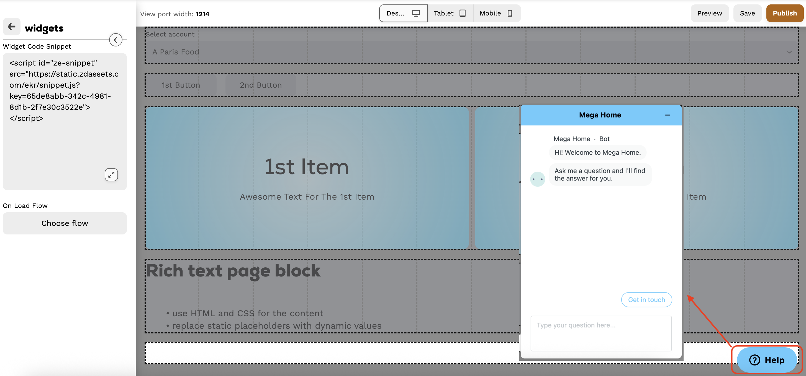

# How to build a Homepage with Pages

## Prerequisites

In order to start building a homepage you need to have all the relevant addons installed e.g. Flows, Buttons block, Gallery etc. Due to there are lot of addons needed to be installed, there is a way to install them in one step - by installing another addon - `AppHeaderInstaller.` You need to install it via Postman, uuid is&#x20;

```
6f15faad-a120-40e2-9e5e-dcb32be1f0bd
```

and version is `0.0.34`  (need to specify it explicitly, as there are no phased versions yet)

## Building a homepage

Homepage consists of two parts: header and body. Header is always visible on webapp (except when custom form is opened), and on devices it is visible only on homepage.


You can still use legacy header with new body, but it won't be visible on devices


### Creating Flows

For full understanding of what are flows and how they work please read this article first.


[flows](../flows/)


Flows are used for all the dynamic actions and calculations on the homepage. There are 3 general types of events which can have a flow that handles it:

* **On Load** - when page or page block is loaded. Mainly used for setting page parameters or changing configuration of a specific block (in case of a page block). Blocks' flows will run after page flow.
* **On Parameter Change** - when at least one of the page parameters was manually changed. In most of the cases it will be triggered when buyer selects another account in the filter block. Filter page block updates AccountUUID page parameter and all the flows that are assigned to <kbd>On Parameter Change</kbd> events will be triggered. Blocks' flows will run after page flow.
* **On Click** - assigned flow runs when user clicks on a specific area on the page.&#x20;


For a quick start you can go to <kbd>Settings -> Configuration -> Flows</kbd> and import basic flows from library


For basic homepage workability you will need to have flows that will handle basic needs like navigation to order, opening activity lists or replacing static text with dynamic values.&#x20;


### Homepage Body

#### General - creating basic page

<kbd>Settings -> Pages -> Page Builder</kbd>

First, start with creating a blank page or importing existing one.


In case of importing from different environment you will need to replace all the images and make sure all the flows are set correctly (because it stores references from origin environment)


In some cases UI import may not work, so you can use API to duplicate the page:

1. GET [https://papi.pepperi.com/v1.0/pages](https://papi.pepperi.com/v1.0/pages) and find a json object of the relevant page
2. Prepare json body
   1. Update the name if needed
   2. If you duplicate the page in the same environment don't forget to change the "Key"
3. POST json body as a single object to the same endpoint

Now you have a page to work with we can go through its configuration

<figure><figcaption></figcaption></figure>

In the "General" section you can setup page parameters, flows, add sections and page blocks

In "Design" tab there are some styling configurations which will be applied to page, e.g. spacing between sections

<figure><figcaption></figcaption></figure>


List of available blocks can be different and depends on the addons installed. If you need a block which is not in the list yet, you need to install a corresponding addon.


#### Sections configuration

Sometimes it is hard to build a homepage which looks good both on desktop and devices. To resolve such issue, sections can be set up to be visible only on specified screen types. The common approach is to add some additional sections which will be shown only for mobile, while those that look good only on desktop, should be hidden.

<figure><figcaption></figcaption></figure>

If you click pencil icon, configuration sub-menu will be opened. There you can split the section into sub-sections which sometimes is a really useful feature

<figure><figcaption><p>Section configuration menu</p></figcaption></figure>


#### Page blocks overview

Gallery, Slideshow, Buttons, Banner, Filter blocks are a bit similar in configuration terms and have <kbd>General</kbd> and  Content  tabs. <kbd>General</kbd> allows to specify main settings to be applied like styling and onload/onchange flows (if supported). Also, these blocks support <kbd>show if</kbd> logic. This allows to hide a specific element of a block depending on page parameters values and condition which was set.

**Gallery**&#x20;

The block is used to show some static images with possibility to add titles.&#x20;

<figure><figcaption><p>Gallery block</p></figcaption></figure>

<kbd>Onload/onchange</kbd> flows allow you to dynamically set titles or to implement some advanced filtering. However, it is better to use <kbd>show if</kbd> when possible.

In the <kbd>Content</kbd> tab, you can edit each of the gallery slides and set on click flow to run any custom action you need.

<figure><figcaption></figcaption></figure>

If a slide is satisfying the <kbd>show if</kbd> logic conditions, it will be shown.


**Slideshow**

The block is used to present slides that can automatically change each other.&#x20;

<figure><figcaption><p>Slideshow block</p></figcaption></figure>

This block has a wider range of possible settings compared to gallery. For example, you can add a button, or make a slide itself clickable

<kbd>Onload/onchange</kbd> flows allow you to dynamically set titles or to implement some advanced filtering. However, it is better to use <kbd>show if</kbd> when possible.

**Buttons**

Allows to add clickable buttons to the page

<figure><figcaption><p>Buttons block</p></figcaption></figure>

There are several styling settings, but if you need something more custom, you can use Gallery block instead by setting up any custom image and onclick flow.

<kbd>Onload/onchange</kbd> flows allow you to dynamically set titles or to implement some advanced filtering. However, it is better to use <kbd>show if</kbd> when possible.

**Banner**

The block is similar to Buttons block but with few more advances

<figure><figcaption><p>Banner block</p></figcaption></figure>

Unlike buttons, you can add an icon (which can be imported from <kbd>Icon selector</kbd> or just an any image you have) and a second title with ability to manage font weight

**Filter**

The block represents a dropdown with some options to choose from

In most of the cases, you will use it for presenting a list of accounts for multi account buyer homepage

<figure><figcaption><p>Filter block</p></figcaption></figure>

Each filter from the <kbd>Content</kbd> tab needs a flow which will return the list of available options. More on how to create a suitable flow you can read in dedicated article:


[flows](../flows/)


**Rich Text**

Allows to use custom HTML on the page. HTML code can be written directly inside block configuration, imported as a file from assets manager or returned by <kbd>onload</kbd> flow.&#x20;

Usage: ideally fits to create a footer for the page

<figure><figcaption><p>Rich Text block</p></figcaption></figure>

<kbd>Onload/onchange</kbd>  events allow you to assign a flow which will replace static placeholders with some dynamic values

**Widgets**

This block allows you to add some external widgets to the page. It requires an HTML script tag which will be added to the page when it is loaded.&#x20;

<figure><figcaption><p>Widget block</p></figcaption></figure>

Your script can contain JavaScript or a link to remoter code.

If your widget is not displayed, try opening the page with network tab in devtools and see if there are:

* any errors or messages in console
* successful http request(s) to get the widget source code
* if those requests are successful, try checking the response, maybe widget configuration is wrong

#### How to combine altogether


### Homepage Header

<kbd>Settings -> Pages -> Application Header</kbd>

Header takes up some defined space on the top of the homepage, and it is primarily needed for quick access to commonly used actions, like notifications, activity lists, logout button etc.&#x20;

Create new header by clicking "Add" in the Application Header Configuration

<figure><figcaption><p>Creating new header</p></figcaption></figure>

* **General** tab - specify the name and description
* **Menu** tab - custom action buttons are defined here. You can assign a flow for each button to be executed on click

<figure><figcaption></figcaption></figure>

Example from above will look like this:

<figure><figcaption></figcaption></figure>

As parameters on the input for flows you can use static, AccountUUID or global parameters.


* **Buttons** tab - currently only notification button is supported. Drag and drop the option from available fields to "Buttons" container to add notifications ring to the header.

<figure><figcaption></figcaption></figure>


Don't forget to publish you changes


## Connecting homepage to buyers

1. Make sure legacy homepage is not used
   1.  Go to `Settings -> Branded App -> Webapp Main Bar` and check if relevant profile has empty configuration. It should look like this:

       <figure><figcaption></figcaption></figure>


   2. Remove any mappings from configuration in the relevant profiles
2.  Go to `Settings -> Pages -> Slugs -> Mapping`

    1.  Add relevant profile (Buyer) if it is not present

        <figure><figcaption></figcaption></figure>
    2. Edit Buyer's profile, drag and drop <kbd>ApplicationHeader</kbd> and <kbd>HomePage</kbd> slugs to the available space. Map your homepage header to <kbd>ApplicationHeader</kbd> and homepage body page to <kbd>HomePage</kbd> slug. Don't forget to save the mappings.

    <figure><figcaption></figcaption></figure>


## Troubleshooting


* when you want to remove the event handling flow from the page / page block:
  * &#x20;You can create an empty flow and assign it instead of existing one.
  * &#x20;Or remove it with Postman.  Use GET [https://papi.pepperi.com/v1.0/pages](https://papi.pepperi.com/v1.0/pages) to get the relevant page JSON, remove flow's base64 text and POST modified object to the same endpoint.
