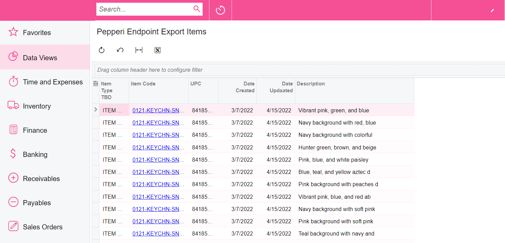
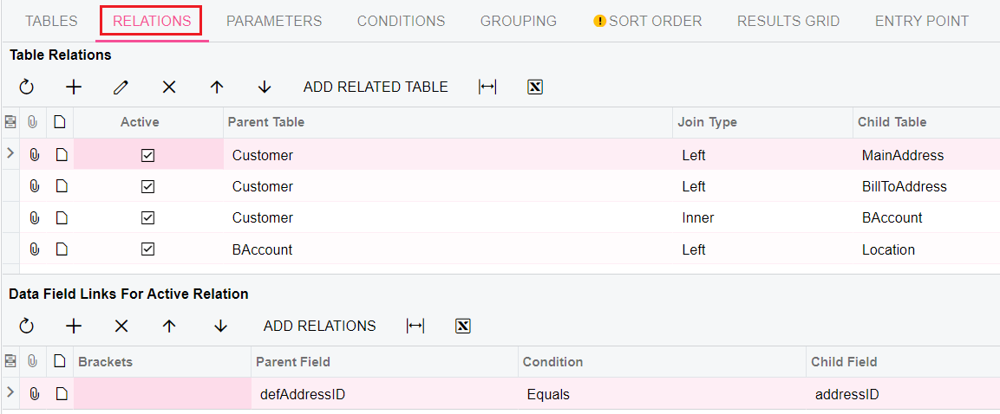
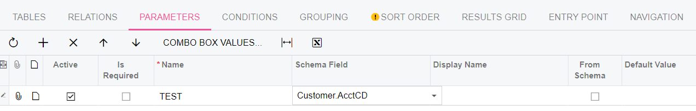
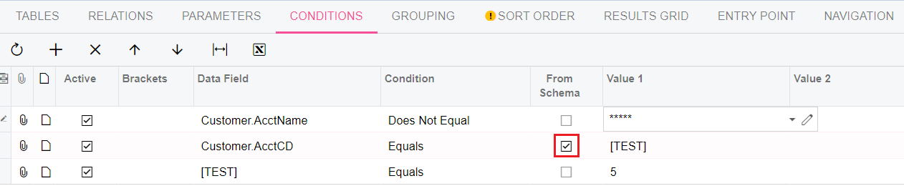
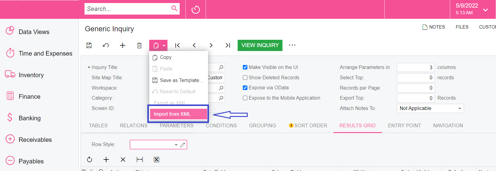

# Acumatica Generic Inquiry

**Generic Inquiry** in Acumatica is a pre-defined query to receive data. It can be found in left menu in 'Data Views' submenu:

.PNG>)

_**In order to create a new Inquiry**_ follow these steps:

In the menu on the left side, select the button More Items → Customization → Generic Inquiry.\
Enter the name of the new Endpoint in the **Inquiry Title** field, set the "_Make Visible on the UI_" and "_Expose via OData_" **checkboxes** enabled.  Also in the **Category** field, select the desired category as shown in the screenshot below.

.PNG>)

_<mark style="color:green;">Arrange Parameters in</mark>_ -always equal to 3;\
&#xNAN;_<mark style="color:green;">Select Top</mark>_ - you can use this field to limit the amount of data. For example, we can enter 5 and in the view we will see only 5 goods. (default is 0 - any restrictions are removed);\
&#xNAN;_<mark style="color:green;">Records per Page</mark>_ - number of records per Page; 

As soon as a new inquiry is created, a Screen ID is created. Then when we access this Screen ID API, the API will return it.

### &#x20;    **How to set up Inquiries?**

**1.TABLES**\
&#x20;We must specify a **list of all tables** that are needed in order to create a data sample. To see the list of available items (in our case) click on the view button.

.PNG>)

**2.** **RELATIONS**\
The next step is to build the right relationship. For example, for customers, we can join ShipTo or BillTo Address. You can see an example below.

**3.PARAMETERS**\
Parameters are required in order to then create conditions and use them in filters. It's like a variable, only for the API&#x20;

\
**4.CONDITIONS**\
Conditions are needed in order to create certain conditions - data filter. For example, I want to take all clients except the client with this name. You can also filter the data using the variables that were created in the Parameters tab. Thus, to limit the amount of data required, we can use the API. See example below.

For example, if we need to return data for the last 40 days, we can use the condition:\
&#x20;_**DocDate is Equals @today-40.**_\
All available mathematical conditions and formulas can be written by clicking on the pencil ✎.

.PNG>)

**5.GROUPING** makes it possible to group data

**6.SORT ORDER** allows you to specify by which parameter the data will be sorted.

**7.RESULTS GRID** tab allows you to specify which columns will be in the final table.

.PNG>)

### **IMPORTANT!**&#x20;

In order not to configure Inquiry every time, you can download existing ones via Import, which you can find below in the archive.







 
