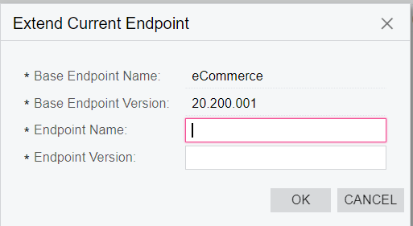
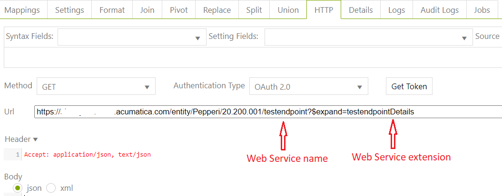

# Acumatica Web Services

Web Service in Acumatica is a powerful tool that allows to establish REST API connection with ERP. \
\
**In order to&#x20;**_<mark style="color:green;">**create a new Web Service in Aсumatiсa**</mark>_**,** you need to enter **Web Service Endpoints** in the search and go to any existing Endpoint, for example _eCommerce_ or _Default_. Then we press _**EXTEND ENDPOINT**_ and a new module is created based on the current. In this case you will have access to current endpoints of basic webservice plus add additional enpoints for Generic Inquiries

.PNG>)

Fill Endpoint Name and Endpoint Version fields and thus a new module is created.

&#x20;We also have the option to create **additional APIs** by clicking on **INSERT** and filling in the required fields.&#x20;

.PNG>)


After filling in the Object Name field and selecting the Screen Name (relevant Generic Inquiry), we generate a **Screen ID** which we can insert into the address bar and get a link with prepared data.&#x20;

.PNG>).PNG>)


After we have created a new Web Service, \<ApiName>Details is automatically created where the fields that we have selected in \<ApiName> → Fields → Populate are displayed. See an example of adding fields to a view below.

.PNG>)

.PNG>)

In order to add columns, you need to select the Result object

.PNG>)

#### **How to generate http string to get data in dataflow task?**

<mark style="color:blue;">https://\<customerDomain>.acumatica.com/\<module name>/\<module version>/\<Web Service name>?\&expand=\<Web Service extension></mark>

This creates an array of testendpointDetails with the fields we have selected.&#x20;

_**IMPORTANT!**_ You also need to add the setting **http\_row\_element = \<Web Service extension>** to the settings.

