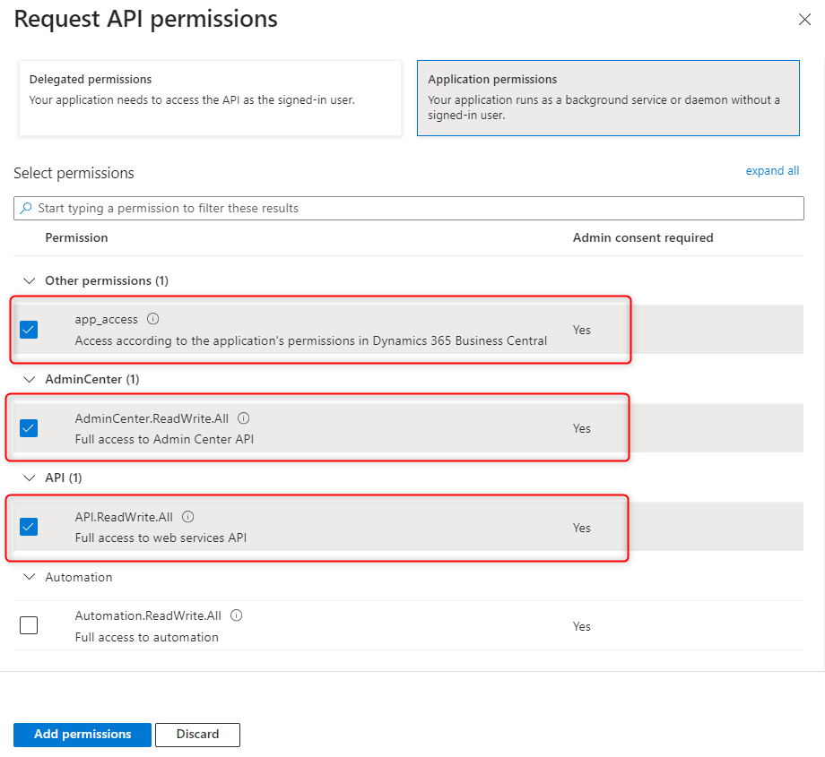

# Dynamics BC - Azure configuration

### Overview

Azure configuration is essential when integrating or customising Dynamics 365 Business Central because Dynamics BC relies on **Azure Active Directory (Azure AD)** and other Azure services for secure access, identity management, and API interaction. Here’s why it is necessary:

* **OAuth 2.0 Authentication**: Azure AD is used to authenticate external applications and users. It ensures secure access to Dynamics BC resources.
* **User Identity Management**: Azure AD manages user credentials and permissions for Dynamics BC, ensuring that only authorised users can access or modify data.
* **Integration with External Applications:** Azure configuration allows you to register custom applications (App Registrations) that interact with Dynamics BC via APIs.

***

Follow the steps below to set up a new Dynamics 365 Business Central application in Azure or to modify an existing one.

### App Creation <a href="#new-app-for-bc" id="new-app-for-bc"></a>

Log in to the [https://portal.azure.com/](https://portal.azure.com/) using Microsoft credentials provided by the client

* Search for App Registrations and click on it:

<figure><figcaption></figcaption></figure>

* Click on **New registration** to register a new app:

<figure><figcaption></figcaption></figure>

* Provide the needed configurations:

<figure><figcaption></figcaption></figure>


_Name_ - should be unique among your existing Azure applications, can be changed at any time.

\
&#xNAN;_&#x53;upported account types_ - for the first configuration and testing it's better to choose **Accounts in this organizational directory only**. Once requested it can be changed depending on app features and future requirements.

\
Provide IPaaS _redirect URI_: [https://integration.pepperi.com/mgr/OAuth2/AuthorizeOAuth2](https://integration.pepperi.com/mgr/OAuth2/AuthorizeOAuth2)


* After successful registration you’ll be redirected to the App Overview page, where you can find useful information about your app (Application ID, redirect URIs etc.):

<figure><figcaption></figcaption></figure>

### **Authentication**

* Click on **Certificates & secrets** in the left sidebar and then click **New Client Secret**:

<figure><figcaption></figcaption></figure>

* In the sidebar (appeared on the right) provide **client secret name** and setup **expiration period** (recommended to be 6 months due to security purposes).Then click on **Add**:

<figure><figcaption></figcaption></figure>


<mark style="color:red;">**Attention**</mark><mark style="color:red;">!</mark>&#x20;

Please, copy **client secret** value and store it somewhere separately (save as txt file for example), as it won’t be available on this page after short period of time<br>


<figure><figcaption><p>Secret key which will be unavailable after short-while</p></figcaption></figure>

### API Permissions

* The next step is to configure API permissions for our Azure app. In the left sidebar click on API permissions and in the opened window click on Add a permission:

<figure><figcaption></figcaption></figure>

* Select your target integration system - **Dynamics 365 Business Central**:

<figure><figcaption></figcaption></figure>

* You’ll see two possible variants of permissions. We need to configure both of them, let’s start with **Delegated** permissions:

<figure><figcaption></figcaption></figure>

* Select checkboxes with permissions listed below and click Add permissions:

<figure><figcaption></figcaption></figure>

* Now click again on "**Add a permission"** → "**Dynamics 365 Business Central"** → "**Application permissions"** and select checkboxes with permissions listed below. Then click on Add permissions button:

<figure><figcaption></figcaption></figure>


<mark style="color:red;">**Attention!**</mark>&#x20;

Based on client’s Azure configuration you may need to grant consent for some permissions. Ask your Azure administrator to provide needed permissions for the app. If your account has an administration role - just click on "**Grant admin consent for …"** near the "**Add a permission button"**.&#x20;

On the screenshot below you can see an example for user who is not an administrator and the button is disabled for him:

.png>)


### API scope

* Now let’s configure default API scope. In the left sidebar select "**Expose an API"** and then click on "**Add a scope"**:

<figure><figcaption></figcaption></figure>

* Application (client) ID is set here automatically, check that this ID matches your target application ID (Overview tab). Then click on Save and continue:

<figure><figcaption></figcaption></figure>

* Here is an example of scope creation parameters. Fill in the required fields and click on Add scope:

<figure><figcaption></figcaption></figure>

### Redirect URIs

* In  order to successfully retrieve data using Azure, we need to configure redirect URLs, which will save auth data to pepperi.
* Go to the redirect URLs tab through "**Overview**" or "**Authentication**" tabs

<figure><figcaption></figcaption></figure>

Here is the list of redirect URLs for the "**Web"** platform (including postman for testing purposes):

```
https://oauth.pstmn.io/v1/browser-callback
https://oauth.pstmn.io/v1/callback
https://integration.pepperi.com/mgr/OAuth2/AuthorizeOAuth2
https://businesscentral.dynamics.com
https://businesscentral.dynamics.com/OAuthLanding.htm
```

<figure><figcaption></figcaption></figure>
