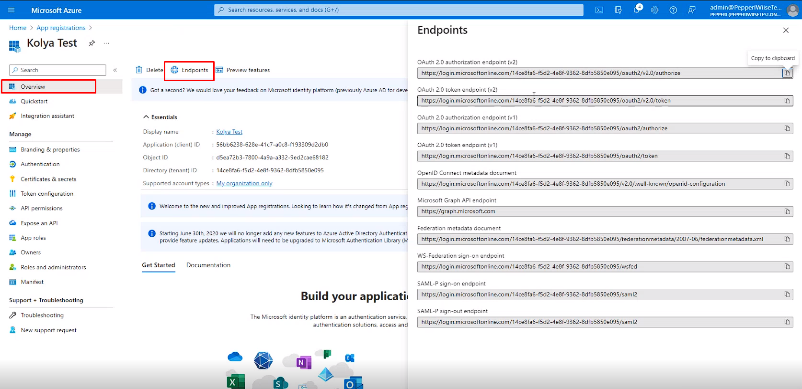

# Dynamics BC - oAuth 2.0 token generation

### Configuration

1. Create a new Dataflow task or go to the existing one
2. Go to the HTTP tab
3. Choose "Auth Type" = OAuth 2.0
4. Click on Get Token

<figure><figcaption></figcaption></figure>

Here you will need to fill in the required parameters.

<figure><figcaption></figcaption></figure>

**Initial Parameters**

* **Application Unique Name** - specify name for this token (or leave ‘default’)
*   **Consumer Key**

    Go to your Azure application page → **Overview** tab.

    There you have **Application (client) ID**, this is your **consumer key**
*   **Consumer Secret**

    Go to your Azure application page → **Certificates & secrets** tab.

    There you have **client secret value** (it can be hidden, you should have stored its value after the generation), this is your **consumer secret**

***

**Authorization URL, Access Token URL, Scope**

Go to your Azure  [https://portal.azure.com/](https://portal.azure.com/)  application page → **Overview** tab → **Endpoints**

<figure><figcaption></figcaption></figure>

*   **Authorization URL:**

    OAuth 2.0 authorization endpoint (v1) + ‘?resource=https://api.businesscentral.dynamics.com’
*   **Access Token URL:**

    OAuth 2.0 token endpoint (v1) + ‘?resource=https://api.businesscentral.dynamics.com’
*   **Scope**

    Go to Azure application page → **Expose an API** tab.

    There you have **Application ID URI,** this is your **Scope**

***

**Advanced**

Click on Advanced tab to open additional configurations and fill in:

* **Renew Access Token URL** - same as Access Token URL\
  OAuth 2.0 token endpoint (v1) + ‘?resource=https://api.businesscentral.dynamics.com’
* **Resource** - specify ‘[https://api.businesscentral.dynamics.com](https://api.businesscentral.dynamics.com)’ here

<figure><figcaption></figcaption></figure>

Then you can press "Generate Token" and confirm access. The token will need to be regenerated after 6 month (or after the time period set in Azure)

### Common issues



<mark style="color:red;">**Issue:**</mark> <mark style="color:red;"></mark><mark style="color:red;">The user or administrator has not consented to use the application with ID</mark> <mark style="color:red;"></mark><mark style="color:red;">**\[ApplicationID]**</mark> <mark style="color:red;"></mark><mark style="color:red;">named</mark> <mark style="color:red;"></mark><mark style="color:red;">**\[ApplicationName]**</mark><mark style="color:red;">. Send an interactive authorization request for this user and resource</mark>

<mark style="color:green;">**Solution:**</mark> In Azure Portal navigate to **App Registrations** → **API Permissions** and check if all required permissions are provided for the app



<mark style="color:red;">**Issue:**</mark> <mark style="color:red;"></mark><mark style="color:red;">Unauthorized: The credentials provided are incorrect</mark>

<mark style="color:green;">**Solution 1:**</mark> In Azure Portal navigate to **App Registrations** → **API Permissions** and check if all required permissions are provided for the app

<mark style="color:green;">**Solution 2:**</mark> In Azure Portal navigate to **App Registrations** → **Certificates and secrets** and make sure that client secret key is not expired. If it is - generate a new one and reconfigure the token in IPaaS.



Issue: AADSTS7000222: The provided client secret keys for app **\[ApplicationID]** are expired. Visit the Azure portal to create new keys for your app: [https://aka.ms/NewClientSecret](https://aka.ms/NewClientSecret), or consider using certificate credentials for added security: [https://aka.ms/certCreds.](https://aka.ms/certCreds.)

Solution: In Azure Portal navigate to **App Registrations** → **Certificates and secrets,** generate a new key and reconfigure the token in IPaaS.


