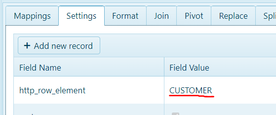
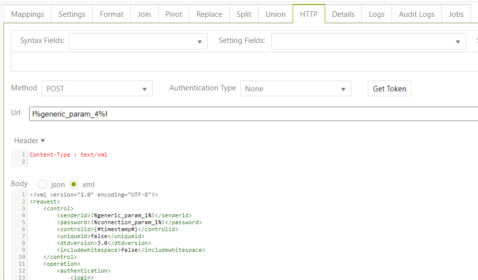

# Intacct Integration(Sage Intacct)

## Setting up the Dataflow task:

×          Description: \<name>

×          Application: Generic HTTP Connector

×          Source Object: Generic Http Exporter

×          Target Object: \<Depends on a usage>

<figure><figcaption></figcaption></figure>


**Important:** In order to get the correct response from the server, add setting **http\_row\_element** and put your \<object> name


**Example:**&#x20;

<figure><figcaption></figcaption></figure>

## &#x20;HTTP Header request


Content-Type: **text/xml**

Method: **POST**       (always)


<figure><figcaption></figcaption></figure>

## XML request body

Full body for request:

```
<?xml version="1.0" encoding="UTF-8"?>
<request>
    <control> <!-- important tag -->
        <senderid>!%generic_param_1%!</senderid>
        <password>!%connection_param_1%!</password>
        <controlid>{#timestamp#}</controlid>
        <uniqueid>false</uniqueid>
        <dtdversion>3.0</dtdversion>
        <includewhitespace>false</includewhitespace>
    </control>
    <operation>
        <authentication> <!-- important tag with connection -->
            <login>
                <userid>!%generic_param_3%!</userid>
                <companyid>!%generic_param_2%!</companyid>
                <password>!%connection_param_3%!</password>
            </login>
        </authentication>
        <content>
            <function controlid="{#new_guid#}"> <!--function also important tag-->
                <query> <!--can be: <query>,<create>,<delete>,<lookup>,<read>,<readByName>-->
                    <object>CUSTOMER</object> <!--name of table where u wanna get/update data-->
                    <select>
                        <field>CUSTOMERID</field>
                        <!-- and other fields what u need -->
                    </select>
                    <filter> <!--example of condition-->
                        <equalto> 
                            <field>STATUS</field>  <!--example of condition-->
                            <value>active</value>  
                        </equalto>
                    </filter>
                    <pagesize>1000</pagesize> <!-- Paging for get all -->
                    <offset>$#({#page_num#} - 1) * 1000#$</offset><!-- Paging for get all -->
                </query>
            </function>
        </content>
    </operation>
</request>

```


**\<authentication>** and **\<control>** tags are static, except for access keys. They are provided by the customer.&#x20;

**\<function controlid="{#new\_guid#}"> \</function>** is where we configure the request.


## Requests to retrieve data

### Get  any field

to retrieve any field, use **\<lookup>** tag:

```
<function controlid="{#new_guid#}">
       <lookup>
              <object> CUSTOMER </object> <!--  what u wanna check-->
       </lookup>
</function>
```


If **http\_row\_element is not set** or it contains incorrect value, you may receive an error. Nevertheless, the response from the server will be fine. Download txt Document and open it in VS Code.


&#x20;

## Get fields by Customer ID

If you need to get all/needed columns for some Customer(s) by RECORDNO(id) use **\<read>** tag :

```
<function controlid="{#new_guid#}">
       <read>
              <object> CUSTOMER </object> <!--  what u wanna check-->
              <keys> RECORDNO </keys> <!-- u can use “,” for more RECORDNO -->
              <fields> * </fields> <!-- u can use “,” for fields what u need -->
       </read>
</function>
```

### Get fields for Customer with filter

If you need to get the list with some conditions use **\<query>** tag:

```
<function controlid="{#new_guid#}">
       <query>
              <object> CUSTOMER </object> <!--  what u wanna check-->
              <filter>
       <greaterthan> <!--  expression -->
       <field>TOTALDUE</field>
       <value>100</value>
</greaterthan>
</filter>
              <select>  <!--  fields what u wanna take -->
       <field>RECORDNO</field>
       <field>TOTALDUE</field>
</select>
       </query>
</function>
```

All expressions:&#x20;

* \<greaterthan>,&#x20;
* \<notequalto>,&#x20;
* \<lessthan>,&#x20;
* \<lessthanorequalto>,&#x20;
* \<greaterthanorequalto>,&#x20;
* \<isnull>,&#x20;
* \<isnotnull>

All logical expressions:&#x20;

* < between>,&#x20;
* \<in>,&#x20;
* \<notin>,&#x20;
* \<like>,&#x20;
* \<notlike>


More information about filters:  [here](https://developer.intacct.com/web-services/queries/#filter)


### &#x20;Requests to send Data

### Create Customer

&#x20;use **\<create>** Tag:

```
<function controlid="{#new_guid#}">
       <create>
<CUSTOMER> <!--  where u wanna create -->
       <CUSTOMERID></CUSTOMERID> <!-- that intacct generate -->
       <NAME>Test</NAME>
       ...
</CUSTOMER>
       </create>
</function>
```


for **CUSTOMERID** we need use response and set that to PepperiID, see example:

https://integration.pepperi.com/mgr/PluginSettings/ClientTask?TaskId=72312



See all the fields that can be mapped [here](https://developer.intacct.com/web-services/queries/#filterhttps://developer.intacct.com/api/accounts-receivable/customers/#create-customer).


### &#x20;Update Customer&#x20;

use **\<update>** tag:

```
<function controlid="{#new_guid#}"> 
	<update>
<CUSTOMER> <!--  where u wanna create --> 
	<CUSTOMERID>$#ExternalID#$</CUSTOMERID> <!-- what account to update -->
	<NAME>Test</NAME>
	...
</CUSTOMER> 
	</update>
</function>

```


\*for CUSTOMERID see example: [https://integration.pepperi.com/mgr/PluginSettings/ClientTask?TaskId=72325](https://integration.pepperi.com/mgr/PluginSettings/ClientTask?TaskId=72325)



