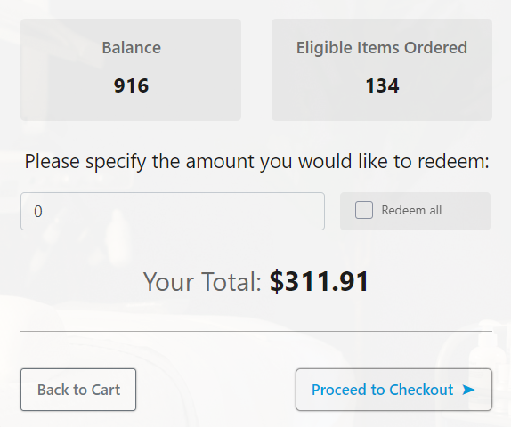

# Kangaroo Integration

<figure><figcaption></figcaption></figure>

Loyalty program. Integration that allows you to use kangaroo service that tracks the client’s bonus points. Bonus points are added not only from purchases but from social activity also. You can set up the ways by which your points are added in the service settings.

For more information on how to connect to the Kangaroo Rewards API, etc., please, see the following link:&#x20;


