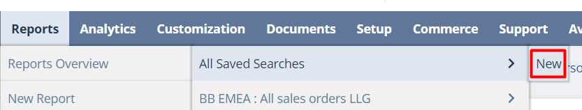

# Customers Aging Report NS

In order to make this report you need to create a Saved Search in Netsuite.

Please do the following steps:

1\.         Navigate to **Reports > Saved Searches > All Saved Searches > New** > Click on **Transactions**

<figure><figcaption></figcaption></figure>

<figure><figcaption></figcaption></figure>

2\.         Under **Criteria** tab > **Standard** sub tab set the following:\
\
&#x20;           a. **Account Type**: is any of **Accounts Receivable**\
&#x20;           b. **Status** is none of **Invoice: Paid in Full, Invoice: Pending Approval**\
&#x20;           c. **Amount Remaining** = is not equal to **0.00**

<figure><figcaption></figcaption></figure>

3\.         On the **Results** tab > **Columns** sub tab > Click **Remove All** button and then add the following:\
\
a. **Formula (Currency)** \
Set Summary Type = **Sum**\
\
Formula:\
**case when trunc({today})-{duedate} < 0 then {amount} end**\
\
Custom Label: **Current**\
\
&#x20;\
b. **Formula (Currency)**\
Set Summary Type = **Sum**\
\
Formula: \
**case when trunc({today})-{duedate} between 1 and 30 then {amount} end**\
\
Custom Label: **1-30**\
&#x20;\
c. **Formula (Currency)**\
Set Summary Type = **Sum**\
&#x20;\
Formula: \
**case when trunc({today})-{duedate} between 31 and 60 then {amount} end**\
\
Custom Label: **31-60**\
&#x20;\
d. **Formula (Currency)**\
Set Summary Type = **Sum**\
\
Formula:  \
**case when trunc({today})-{duedate} between 61 and 90 then {amount} end**\
\
Custom Label: **61-90**\
&#x20;\
e. **Formula (Currency)**\
Set Summary Type = **Sum**\
\
Formula:  \
**case when trunc({today})-{duedate} > 90 then {amount} end**\
\
Custom Label: **Over 91**\
&#x20;\
f. **Formula (Currency)**\
Set Summary Type = **Sum**\
\
Formula:  \
**NVL(case when trunc({today})-{duedate} < 0 then {amount} end,0)+ NVL(case when trunc({today})-{duedate} between 1 and 30 then {amount} end,0) + NVL(case when trunc({today})-{duedate} between 31 and 60 then {amount} end,0) + NVL( case when trunc({today})-{duedate} between 61 and 90 then {amount} end ,0)+ NVL(case when trunc({today})-{duedate} > 91 then {amount} end,0)**\
&#x20;\
Custom Label: **Total Outstanding**

&#x20;           **g. Customer : Internal ID**\
Set Summary Type = **Group**

<figure><figcaption></figcaption></figure>

<figure><figcaption></figcaption></figure>

4\.         Add a Search title eg. Pepperi - A/R Aging Summary Search

5\.         If you will need to create a dataflow in ipaas for this saved search please enable the ‘Public’ checkbox. In other case the dataflow will fail with an error

.png>)

6\.         Click on **Save & Run**
