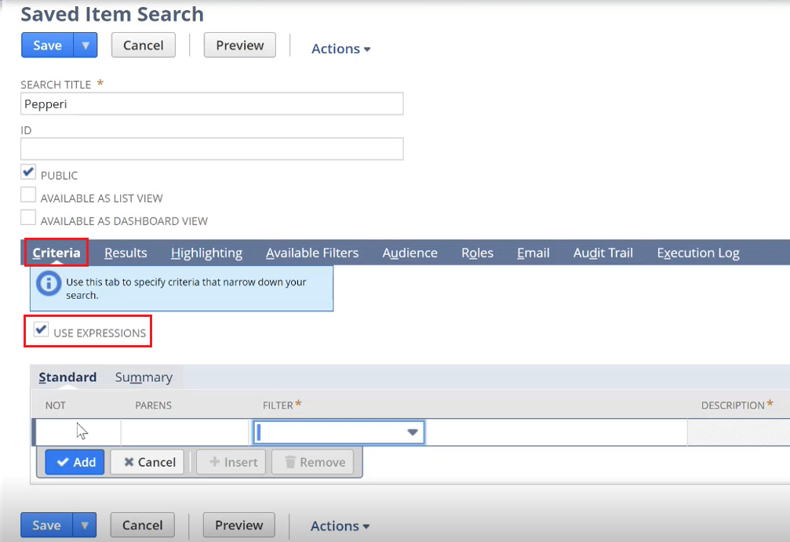

# NetSuite Dataflow Task Creation


Before doing these tasks please make sure you have Granded necessary access to your user Integration.\
You can find in point 14 of the "NetSuite Authentication" article [https://kbint.pepperi.com/integration-platform-ipaas/integration-with-different-erp-systems/netsuite-integration/netsuite-authenticatio](https://kbint.pepperi.com/integration-platform-ipaas/integration-with-different-erp-systems/netsuite-integration/netsuite-authentication)


In order to create a dataflow task, we need to set&#x20;

* **Application:** NetSuite Plugin
* **Source Object:** choose from the list


The **Source Object** specifies the request type and does some validation. It happens that we send a request, but we get an error like "**such field does not exist**". To do this, if this is additional information that is not in the Source Object , we choose the **Special Price List** **as** the generic **Source Object**.

.PNG>)


After we have filled all the necessary settings in **General Settings** and created a dataflow task, we need to set only one setting **saved\_search\_id.**&#x20;

.PNG>)

1. In order to get _saved\_search\_id_ go to  --> **“List”** --> **“Search”** ---> **“Saved Searches”**

.PNG>)

&#x20;\--->  **“New Saved Search”** and select the required type for Saved Search (for example, for items)

.PNG>)

2\. After we have created Saved Search fill in the **Search Title** (it’s better to always start with the Pepperi, as it will be easy to find it later) and put the **checkbox Public**

.PNG>)

3\. **Also we can customize our Saved search**\
\
&#x20;    3.1  **Criteria** to filter the amount of data (you can use USE EXPRESSIONS to select AND,OR operations as the default is AND)

\
&#x20;    3.2 **Results** to show selected columns

.PNG>)

.PNG>)

After we saved the Saved Search, an **saved\_search\_id** is created.

**IMPORTANT!** As for _<mark style="color:green;">**saved search on images**</mark>_ we need to set only IDs for the desired images with the correct column names.&#x20;

.PNG>)

After that, you need to set the settings in Details as shown below.

.PNG>)
