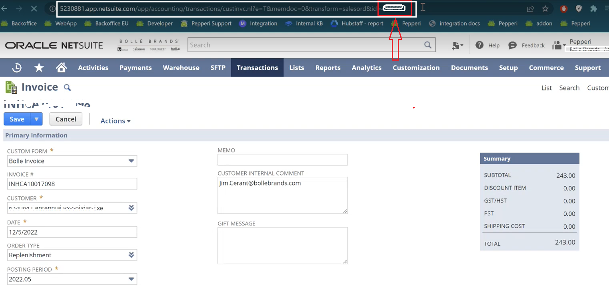
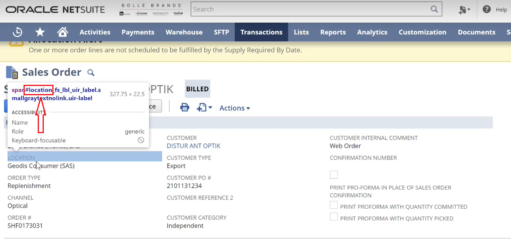
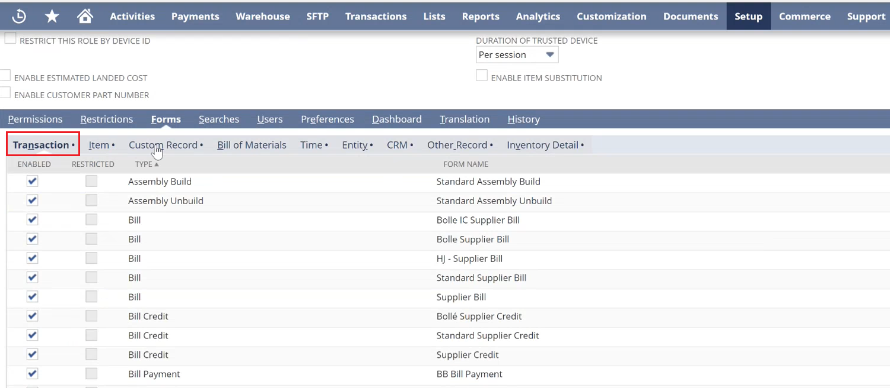
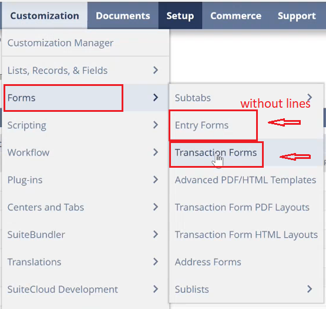
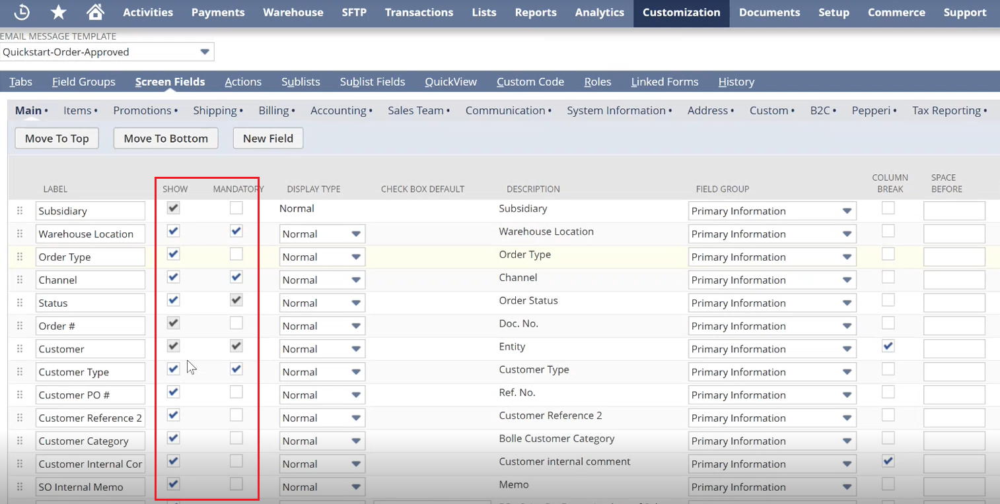

# NetSuite Webhook Task Creation


Before doing these tasks please make sure you have Granded necessary access to your user Integration.\
You can find in point 14 of the "NetSuite Authentication" article [https://kbint.pepperi.com/integration-platform-ipaas/integration-with-different-erp-systems/netsuite-integration/netsuite-authenticatio](https://kbint.pepperi.com/integration-platform-ipaas/integration-with-different-erp-systems/netsuite-integration/netsuite-authentication)


Webhooks are of two types. Old and new.

The old ones contain a **header, lines and accounts**. If you see this type of webhook, be sure to fix it for a new one.

**Use TBA (Token Based Authentication) in tasks**

**DataFlow tasks:** DataFlow tasks will automatically use the TBA once you use _ns\_is\_tba_ = 1 in the general settings or the tasks settings.

**Webhook tasks: in order to use TBA in Webhook tasks, you will need to use the following header for each request:**

```
<?xml version="1.0" encoding="utf-8"?>
	<soap:Envelope xmlns:xsd="http://www.w3.org/2001/XMLSchema" xmlns:soap="http://schemas.xmlsoap.org/soap/envelope/" xmlns:xsi="http://www.w3.org/2001/XMLSchema-instance">    
		 <soap:Header>
			<tokenPassport xmlns="urn:messages_2018_1.platform.webservices.netsuite.com">
				<account xmlns="urn:core_2018_1.platform.webservices.netsuite.com">!%nsaccount%!</account>
					<consumerKey xmlns="urn:core_2018_1.platform.webservices.netsuite.com">!%ns_consumer_key%!</consumerKey>
					<token xmlns="urn:core_2018_1.platform.webservices.netsuite.com">!%ns_token_id%!</token>
					<nonce xmlns="urn:core_2018_1.platform.webservices.netsuite.com">{#nonce#}</nonce>
					<timestamp xmlns="urn:core_2018_1.platform.webservices.netsuite.com">{#timestamp#}</timestamp>
					<signature algorithm="HMAC_SHA256" xmlns="urn:core_2018_1.platform.webservices.netsuite.com">{#ns_signature#}</signature>
			</tokenPassport>
		</soap:Header>
```


Let's deal with some points:

1. \<record xsi:type="q1:**SalesOrder"**....> - shows import type (SO or Account)
2. \<q1:entity type="typeName" internalId="$#AccountExternalID#$"/>


**IMORTANT!!** On this link you can find a list of all fields for each record type that are available for the customer.\
[https://www.netsuite.com/help/helpcenter/en\_US/srbrowser/Browser2017\_2/schema/record/salesorder.html](https://www.netsuite.com/help/helpcenter/en_US/srbrowser/Browser2017_2/schema/record/salesorder.html)


3\. The <[q1:customFieldList](q1:customFieldList)>tag allows you to add custom fields for sending a webhook.

4\. \<scriptId="field name"> - field name

_**How to find scriptId?**_&#x20;

4.1.Go to Transactions --> Sales --> Sales Order<br>

.PNG>)

4.2. Open any saved search and, as shown in the screenshot below, we can change it to the required scriptID and immediately receive the necessary information about another invoice.



5\. In order to find out the **ID** of the field in the header, you must inspect the element and take the name up to the word <mark style="color:red;">**fs\_**</mark>\*\*\*\*




_<mark style="color:green;">**Helpful Tips!**</mark>_\
\
If you need to send a field according to some condition, for example, if there is a date, then you send it, and if not, then you don’t send it at all. An example syntax can be seen below.

```
 $#IIF(TSAReturnDate='','',
                  	'<customField scriptId="custevent_returndate" xsi:type="DateCustomFieldRef" xmlns="urn:core_2016_1.platform.webservices.netsuite.com">
                    	<value>' + TSAReturnDate + '</value>                                           
                 	</customField>'
                  	)#$
```


If you try to submit a transaction but get an **error** that the field is **ReadOnly**, then check:

1. **Access**\
   Go to Setup--> Users/Roles--> Manager Roles --> find Pepperi Integration&#x20;

.PNG>)

\--> and go to the **Forms** tab and see the list of access for the transaction



2\. **Transaction Forms**\
Customization--> Forms --> Transaction Forms --> find Sales Order with checkbox **PREFERED**



and choose which fields we want to display


