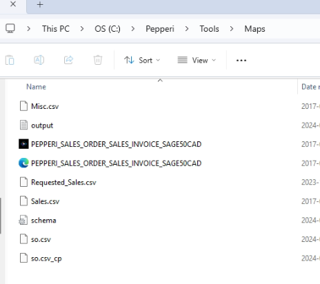
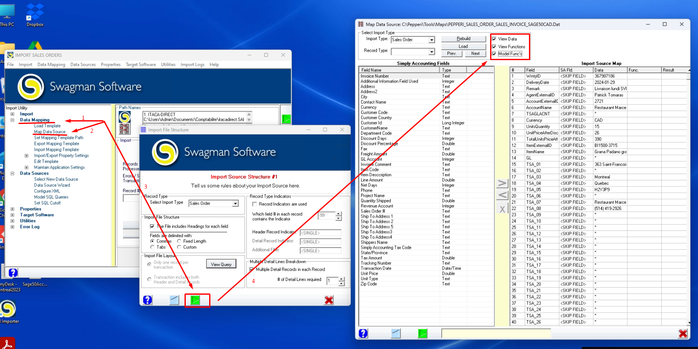

# Swagman Software

### Description:&#x20;

This is the third-party app used for importing Orders to Sage50

### Demo - how does it work:


This is very challenging program to setup or edit. The help of support might be needed.&#x20;


***

Simplified workflow&#x20;

1. Firstly, Downloader is creating final file in specific csv format. (The correct mapping could be found in Swagman)&#x20;

### Mapping in Swagman

The orders to import is taken from one of the files in Tools -> Maps folder.

<figure><figcaption></figcaption></figure>


In "schema" file there is schemas for several files, with column's types


The correct file could be found in Mapping window

<figure><figcaption></figcaption></figure>

To find the columns which are needed for mapping you need to open "Mapping File", in this case so.csv

<figure><figcaption></figcaption></figure>

To see what values are inserting into Sage, go to the mapping window and enable 3 checkboxes in the top right corner

<figure><figcaption>
This is based on the last imported order
</figcaption></figure>

### How to use:

### **Advanced configuration**:


