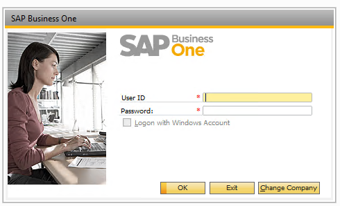

# How to get SAP Credentials

### To connect to the SAP server, a prerequisite is to obtain such credentials from the client: SQL server- <mark style="color:blue;">**User ID,**</mark> <mark style="color:blue;">**Password,**</mark>**&#x20;SAP &#x20;**<mark style="color:blue;">**- CompanyUser, CompanyPass and Companedb**</mark>.

#### **1. For SAP Integration we need to add to the General Settings:**

<table><thead><tr><th width="150">Key</th><th></th><th data-hidden></th></tr></thead><tbody><tr><td>sql_connection</td><td>Data Source=Data Source name;Initial Catalog=DB name;<strong>Integrated Security=False</strong>; UserID=user; Password=***</td><td></td></tr><tr><td>companydb</td><td>Data Source name</td><td></td></tr><tr><td>server</td><td>current server</td><td></td></tr><tr><td>companylang</td><td>3</td><td></td></tr><tr><td>companyuser</td><td>login from SAP</td><td></td></tr><tr><td>companypass</td><td>SAP password</td><td></td></tr><tr><td>servertype</td><td>SQL release year/HANA</td><td></td></tr><tr><td>licenseserver</td><td>server:30000/server:40000</td><td></td></tr><tr><td>desktop_response_timeout</td><td>12000 (if there is a problem with timeouts)</td><td></td></tr></tbody></table>

After we enter the username and password --->  **Change Company** --->select server version ---> select Data Source ---> fill User ID and Password fields---> OK

.PNG>)

**IMPORTANT!** To understand which version of SAP, you need to look at what number the version field begins with. If this is the number 10, then you need to update the importer.

.PNG>)

**2. How to find the transaction in SAP?**

We have 2 types of transactions - _**draft**_ and _**regular**_.

If we need to find a transaction in the **regular** status, we follow Modules ---> Sales AR ---> Sales Order --->insert the ExternalID of the transaction--->enter

.PNG>)


Below you can see the definition of **all fields of the OCRD (Sales Order)table** by clicking on the link [http://www.saptables.net/?schema=BusinessOne9.2\&module\_id=3\&table=OCRD](http://www.saptables.net/?schema=BusinessOne9.2\&module_id=3\&table=OCRD)


If we need to find a transaction in the **draft status**, we follow Modules --->  Sales - AR ---> Sales Reports -->Document Drats Report ---> select the desired report and see the table with the result

 (1).png>)

3\. If you need to get information about a **payment**, for example, about its type, you can find it by following Modules --->  Banking---> Incoming Payments -->Incoming Payments

.PNG>)
