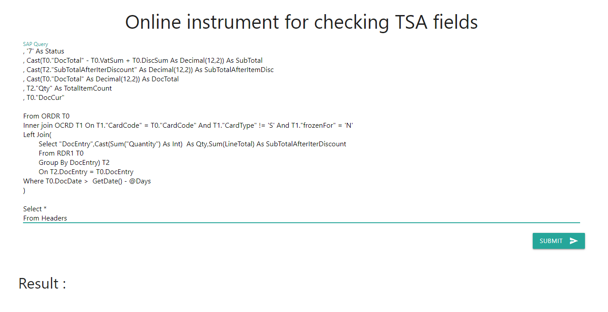

# Online Tool for Checking SAP Custom fields

1\. Open link – [Sap Online Tool for checking custom fields](https://www.pepperi.com/support/instruments/checkFields/)\
2\. Paste your query in text-area.\
**IMPORTANT:** You should wrap fields in your query in quotes(“).\
For example :

\
3\. Click “Submit”.\
4\. Receive result:

.png>)

5\. With Ctrl+F find all rows with TSA fields\
6\. Remove it from Query\
7\. Paste new query in your dataflow Task\
8\. Done:)
