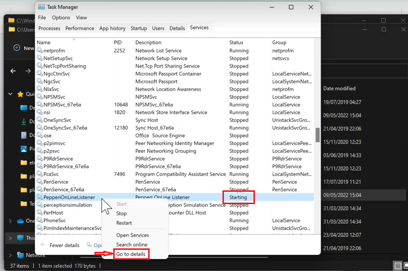

# SAP Webhook possible errors

1. **Listener is not running** - Incorrect Listener ID or incorrectly installed service.\
   You need to stop the service, delete **OnlineListenerService.xml file**, then install the listener;
2. **No results was returned from your remote desktop** - invalid host or incorrect listener version(if the listener does not work (stopped) or incorrectly installed);
3. If the listener is **stuck on Starting** we should follow next step&#x73;**:**

* Windows  --> System32  --> drivers --> etc  -->hosts and delete the last line.

.PNG>)

* Services --> Go to details -->Delete


**IMPORTANT!** If the listener is not killed, but continues to appear in services, use the **command line** with admin access\
**tasklist** --> **taskkill /f /pid \<id>**\
.png>).png>)

After that, PepperiOnloneListener will have the status **Stopped**\
\
We can see status with the help.png>) 


Ready. Launching the listener :)


Also, the reason that the listener is **stuck on Starting** may be that client is blocking site **integration.pepperi.com/support/** on your server. In this case, you need to contact with client.


4\. **Class is not registered** means the wrong listener version(32-bit version on a 64-bit system or vice versa or if SAP version 10 but the Importer is not updated);

5\. **Invalid credentials for user -** or the user does not exist or the password is incorrect;

6\. **Can not login. Please check your credentials -** wrong server, username or password;

7\. -**4009** - incorrect port (**licenseserver** setting) or **wrong server** setting;

8\. -**4008/132** - if version is SAP HANA, but **dbuser** and **dbpass** settings are added. Try remove and add them. It can also happen if the **wrong server** is set;

9\. -**60000003** - incorrect settings if no such server exists at all;

10\. **Could not commit transaction: Error -1 detected during transaction** - most probably that is SAP 10 issue - you have to remove general settings "dbuser" and "dbpass"

11. **License Error Unknown error #100000060** - Change _server_ value : add **HDB@**, example: HDB@DB1srv:30013. More details:&#x20;



