# Authorize.net Quick Setup - Credentials Full Guide

### Description

Full guide for getting and setting Authorize.net credentials for Authorize.net Quick Setup (Merchant Name, Transaction Key, Signature Key)


Learn more about credentials in Authorize.net article [What is the purpose of the API Login ID, Transaction Key, Signature Key and Public Key for Authorize.net, and how can I obtain them?](https://support.authorize.net/knowledgebase/Knowledgearticle/?code=000001271)


### Navigating to the "API Credentials & Keys" page

These steps are needed for getting all of listed credentials.

1\. Login to the Merchant Interface

* if the environment is sandbox - go to the [https://sandbox.authorize.net/](https://sandbox.authorize.net/)
* if the environment is default (production) - go to the [https://login.authorize.net/](https://login.authorize.net/)

2\. In the Merchant Interface navigate to "ACCOUNT" section:

<figure>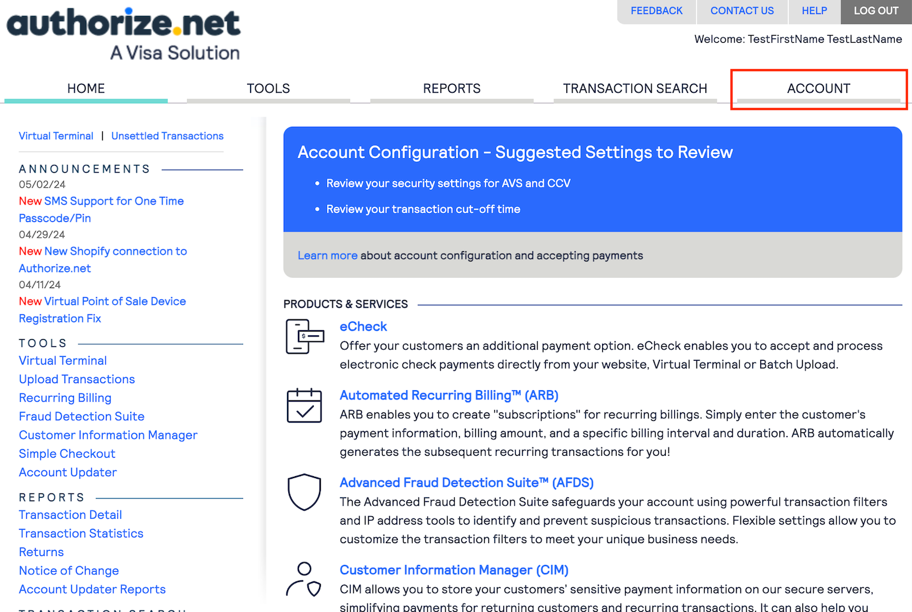<figcaption></figcaption></figure>

3\. Navigate to "API Credentials & Keys":

<figure>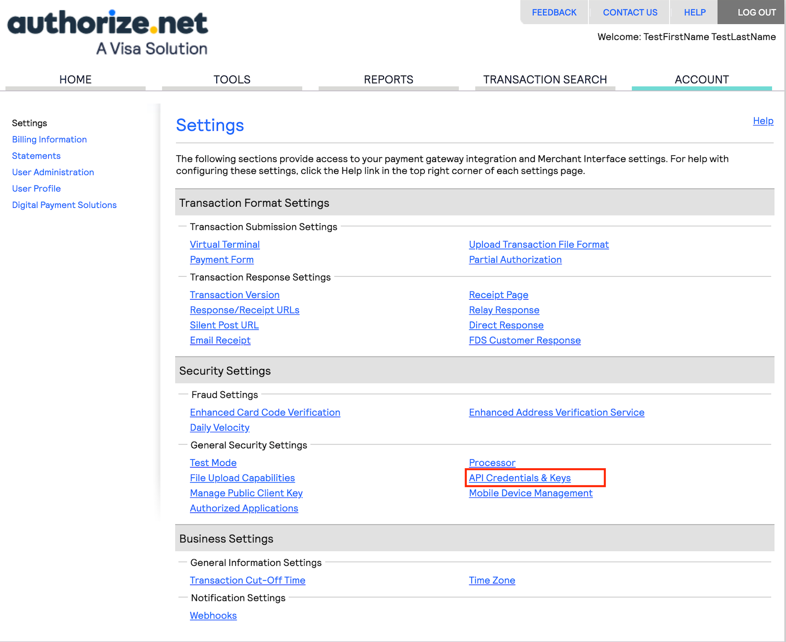<figcaption></figcaption></figure>

### Getting Merchant Name

The "API Login ID" is the **Marchant Name:**

<figure>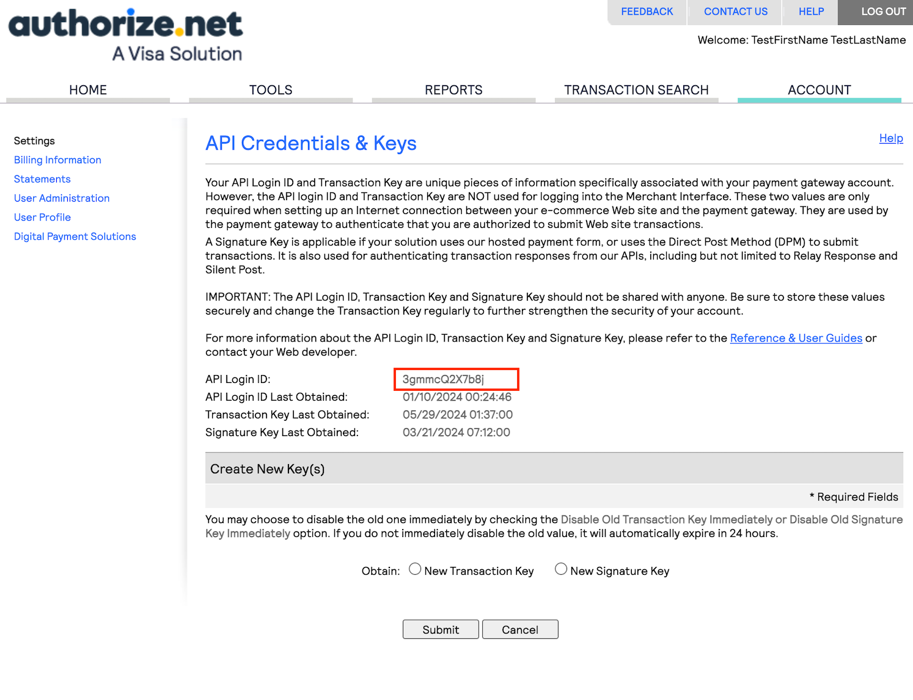<figcaption></figcaption></figure>

### Getting Merchant Transaction Key

1\. To get Merchant Transaction Key on the same "API Credentials" page check "New Transaction Key" and click "Submit":

<figure>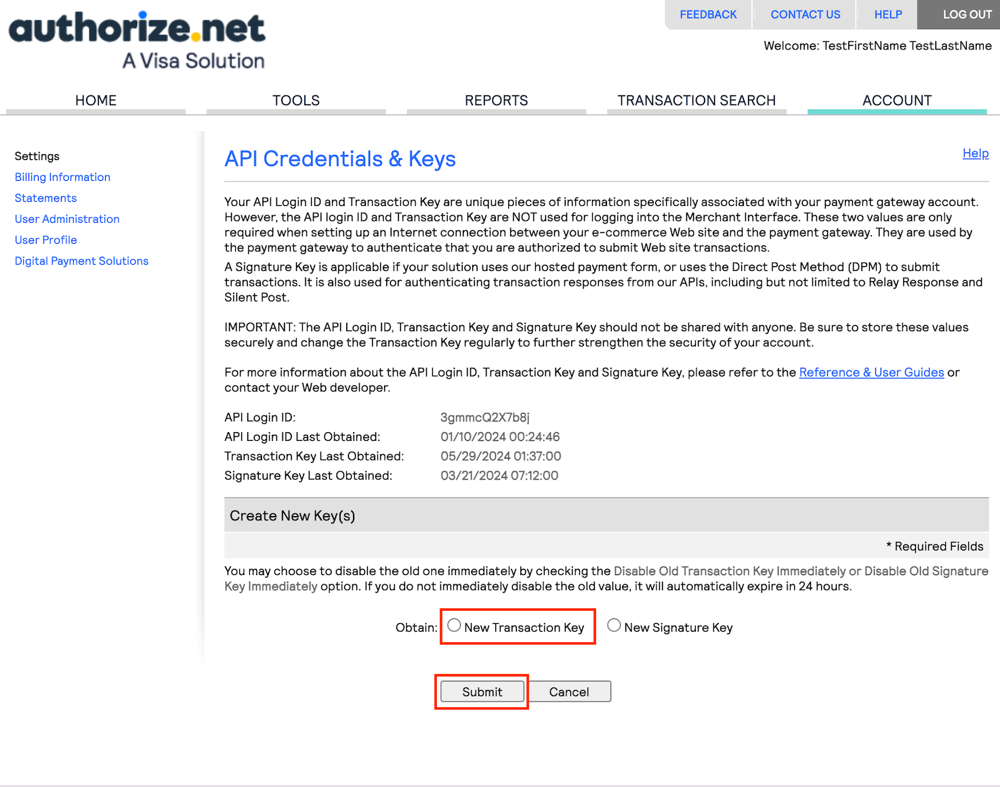<figcaption></figcaption></figure>

2\. You have the Merchant Transaction Key now:

<figure>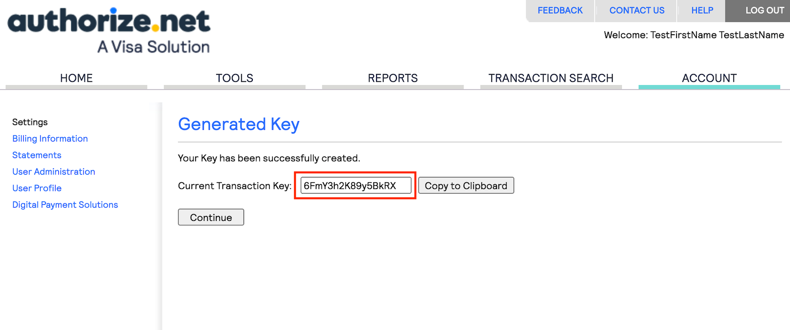<figcaption></figcaption></figure>

### Getting Signature Key (for Authorize.net webhooks)

You must have configured a Signature Key in the Merchant Interface before you can receive Webhooks notifications (if you want to use Authorize.net webhook). This signature key is used to create a message hash that is sent with each notification.


Merchant Transaction Key isn’t saved in Authorize.net environment, so if you forget current Merchant Transaction Key you’ll need to do all of the steps described in currect section again to get the new one.


1\. To get Merchant Signature Key on the "API Credentials & Keys" page check "New Signature Key" and click "Submit":

<figure>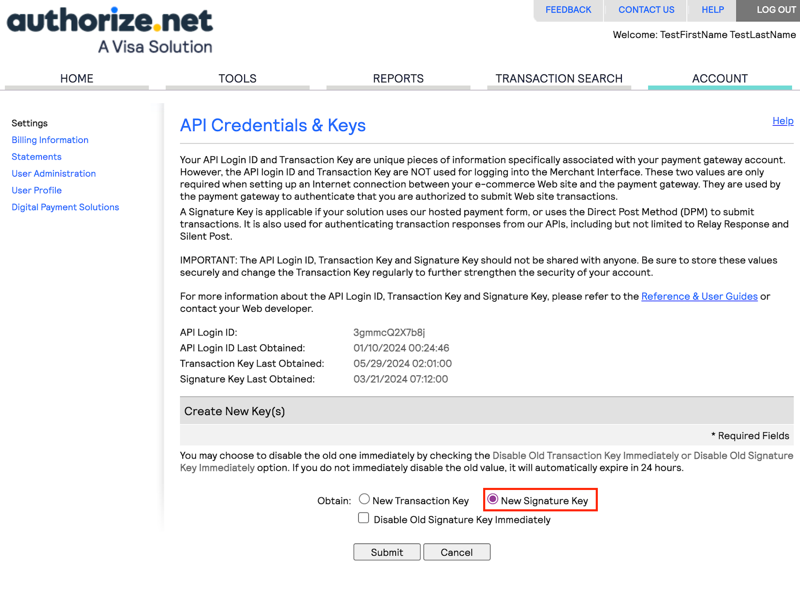<figcaption></figcaption></figure>

2\. You have the Merchant Signature Key now:

<figure>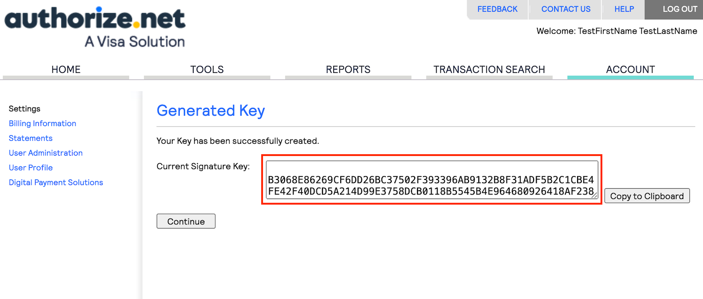<figcaption></figcaption></figure>

### Disable option for Merchant Transaction / Signature Key


If the Disable Old Transaction/Signature Key check box is not selected, the old Transaction or Signature Key will automatically expire in 24 hours. If the old Transaction/Signature Key is not expired, the previous key will continue to be used for the hash/response validation.


To disable the old Transaction or Signature Key, check the box labeled Disable Old Transaction/Signature Key Immediately:

<figure>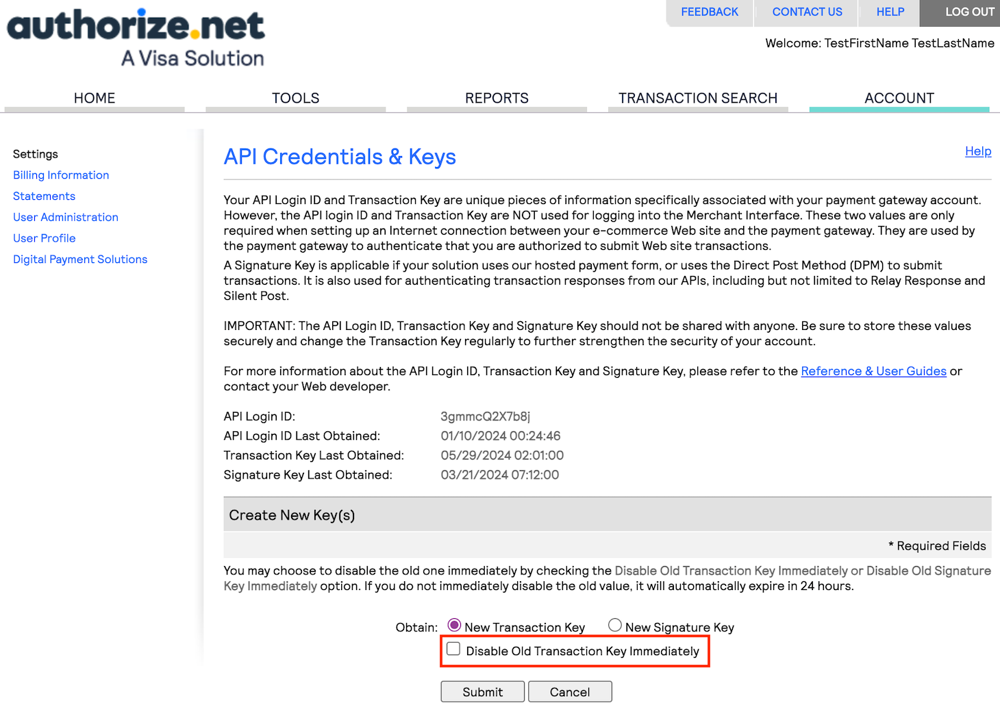<figcaption></figcaption></figure>

## Adding Merchant Name & Transaction Key to the Authorize.net Quick Setup

1\. Open the IPAAS Account

2\. In the Tool tab select "Quick Setup":

<figure>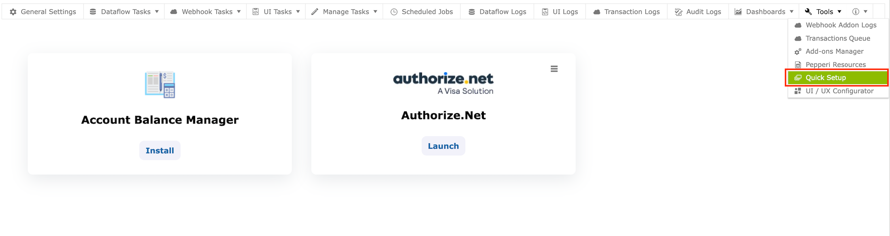<figcaption></figcaption></figure>

3\. Install and then launch the Authorize.net Quick Setup

4\. Click on "Fill Details" button in General tab:

<figure><figcaption></figcaption></figure>

5\. Add here your Merchant Name and Transaction Key and click "OK". Your merchant data will be saved:

<figure>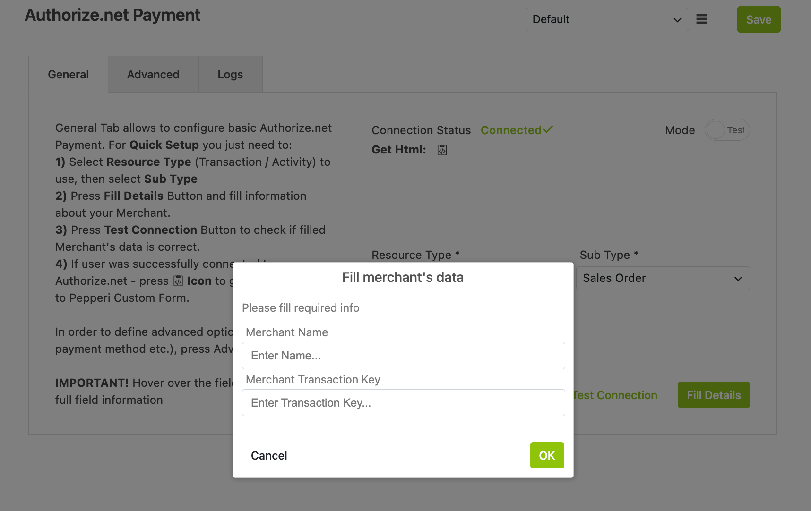<figcaption></figcaption></figure>

6\. Click on "Test Connection" button to check if the credentials are correct:

<figure>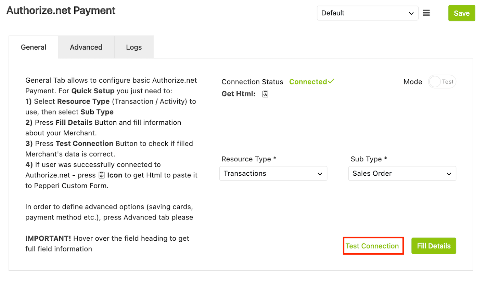<figcaption></figcaption></figure>

## Adding Merchant Signature Key to the Authorize.net Quick Setup

If you want to use Authorize.net webhook for saving the transaction data, you will need to add signature key. It is used to create a message hash that is sent with each transaction submit.

1\. In Authorize.net Quick Setup open the Advanced tab and go to the Duplicates Checks section. You will see the settings for Authorize.net webhook:

<figure>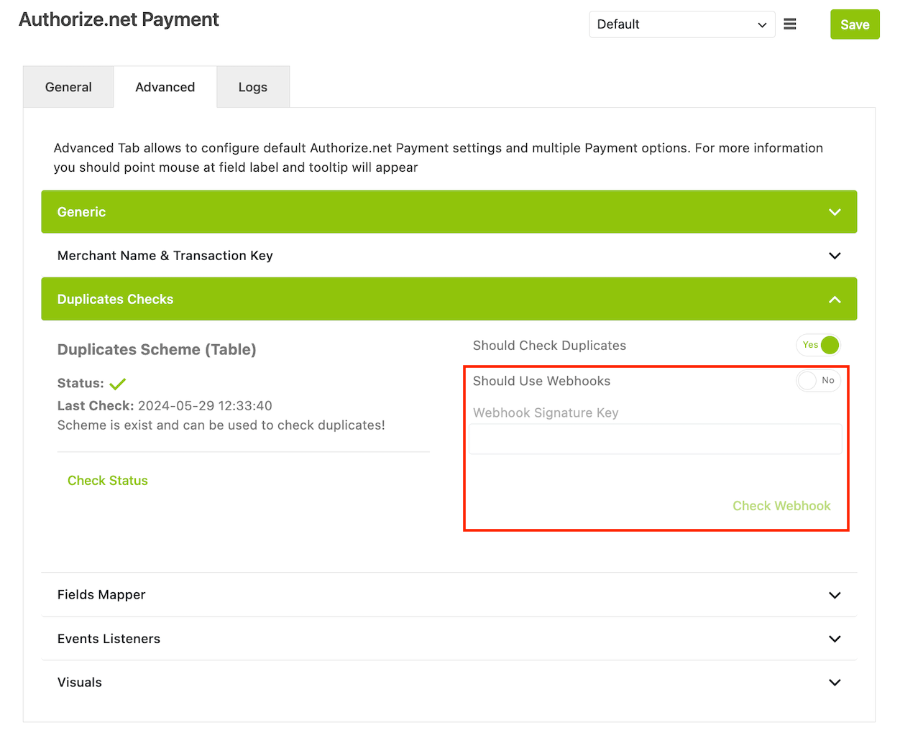<figcaption></figcaption></figure>

2\. If you want to use Authorize.net Webhook check the "Should Use Webhooks" checkbox

3\. Add the Merchant Signature Key to the "Webhook Signature Key" input

4\. Click "Check Webhook" button - if you already have the needed webhook, you will see the message that webhook exists, and if there will be no such a webhook - you will see the message that webhook was created
