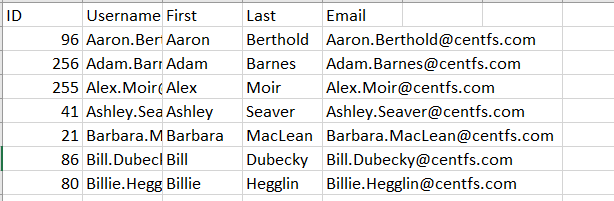
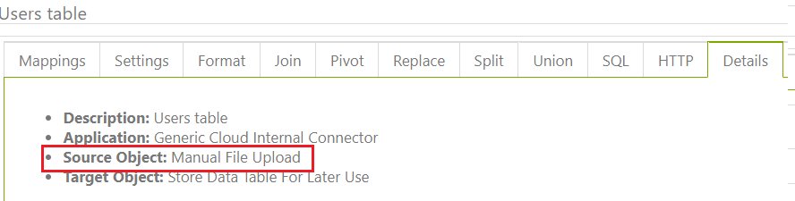
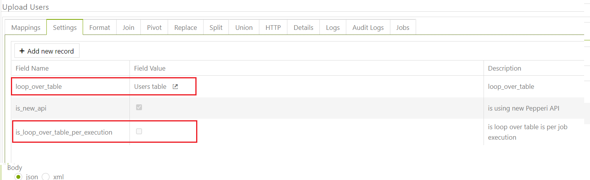
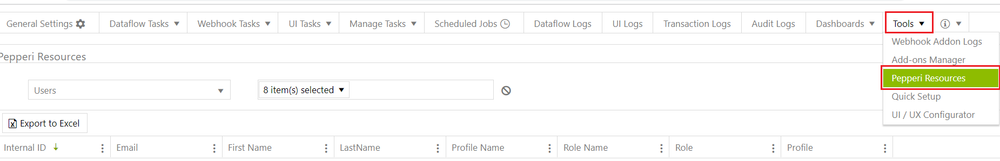
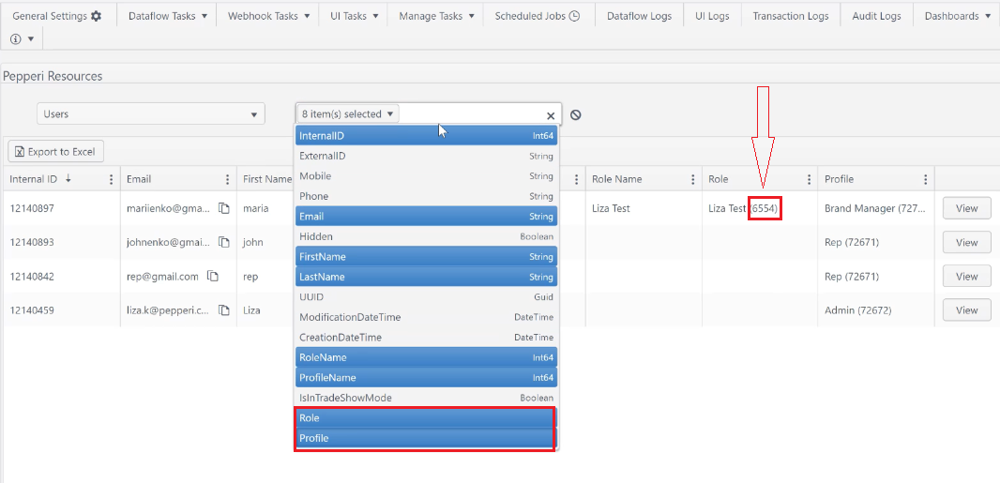
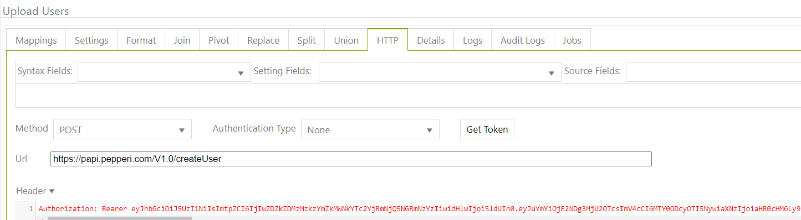

# Create Users

The main idea of ​​this article is to show how to load users into pepperi

In order to upload users follow the next steps:

1. Сreate a dataflow task, which will upload a manually created file with columns like



**IMPORTANT** column is ID (ExternalID)



2\. Сreate a dataflow task, which will take a table with data and do loop\_over\_table of the first dataflow task



&#x20;**the most important parameters are:**&#x20;

"ExternalID": "$#ID#$" - ID with a column from the table

"InternalID": value - we take this value from Tools - Pepperi Resources - Users (add Role and Profile) and see value (6554)





Send an HTTP request [https://papi.pepperi.com/V1.0/createUser](https://papi.pepperi.com/V1.0/createUser)

Enter the current token in Authorization&#x20;



we also create a json Body, the code is given below

```
        {
        "ExternalID": "$#ID#$",
        "Email": "$#Email#$",
        "FirstName": "$#First#$",
        "IsInTradeShowMode": false,
        "LastName": "$#Last#$",
        "Profile": {
            "Data": {
                "InternalID":71398
            }
        },
        "Role": {
            "Data": {
                "InternalID": 6533
            }
        }
    }
```

Ready. Enjoy)
