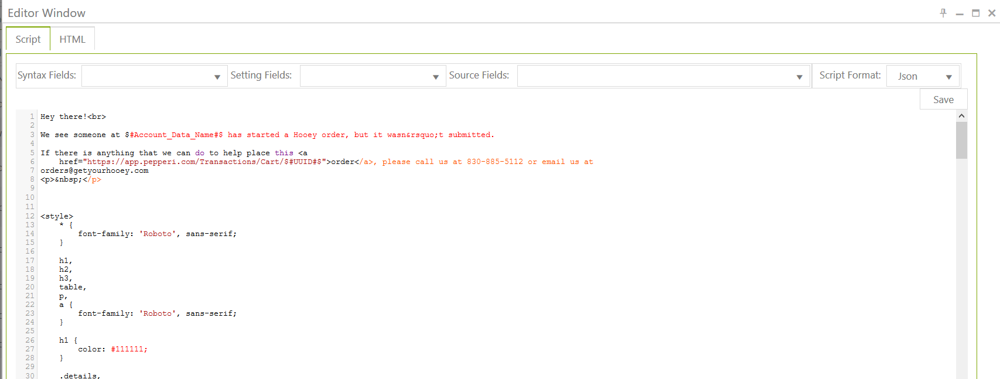

# Send an e-mail about abandoned cart transactions within a period of time

Task: customer want to send emails to  clients when they start order and didn’t finishes it.

In this examples we will see configurations to send client email with order number and items he already put to the cart.&#x20;

_**First task**_ – getting transactions Headers:

.png>)

```
URL: !%new_api_base_uri%!transactions?where=Status=1 AND GrandTotal!=0 AND Type = 'Sales Order'  AND ActionDateTime>='{#getdate(-48,yyyy-MM-ddZ,hour)#}'  AND ActionDateTime<='{#getdate(-24,yyyy-MM-ddThh:mm:ssZ,hour)#}'&page={#page_num#}&page_size=250&full_mode=true
```


In Url above you can see filters.

&#x20;**Status=1** – it’s mean transaction is in creation,&#x20;

**GrandTotal!=0** – at least one item was added to the cart, &#x20;

**ActionDateTime** - period of time for which you want to check transactions.


\
&#xNAN;_**Second task**_ – getting transaction Lines:

.png>)


Here we use data from first task

.png>)


\
Also you might see **is\_loop\_over\_table\_per\_execution** setting – use it when test your tasks. When you have no data for current period of time system will take last data it has and use it. To prevent this use this setting.

_**Third task**_ – configure email subject, body, and send Email to agent/client:

Here we use data from second task. You can enter email subject and where do you want to sent it, it could be static email address or dynamic value.

.png>)


\
Use Editor to configure you email body:

.png>)




\
&#x20;**Note**: Tasks examples you can see at examples integration:

.png>)
