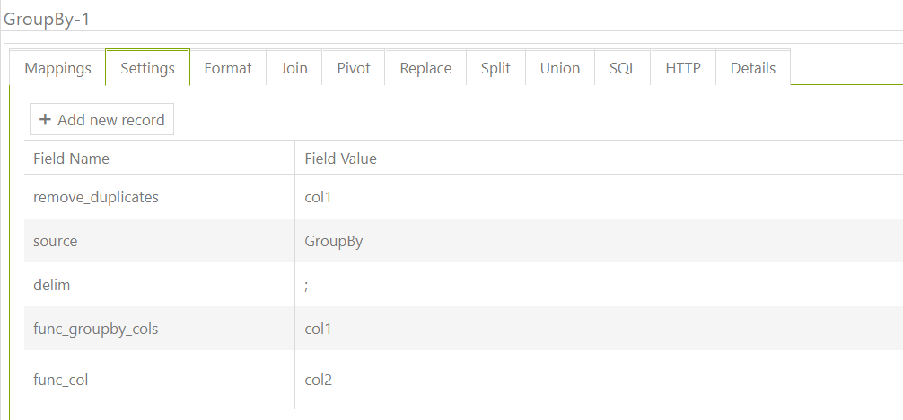

# Grouping

## Group By without aggregation function

For example , you have the next datas (to retrieve data using the task 'GroupBy') :

.png>)

for data conversion we need second task (GroupBy-1) and set the following settings: func\_groupby\_cols, func\_col

The final file will contain the following data:

.png>)

## Group By with aggregation function

Settings the same + group\_func setting with value like 'count' or 'sum'&#x20;
