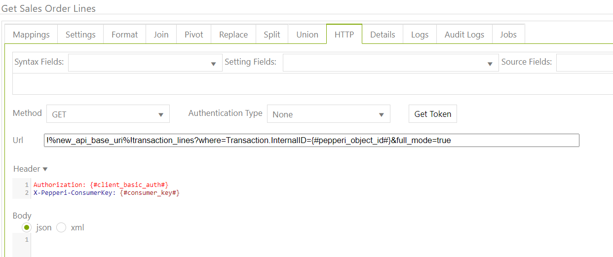
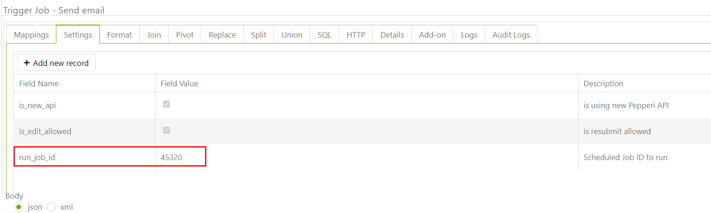

# PDF Send Email

The main idea of ​​this article is to show how to prepare PDF files for sending to a client's email.

As a first step, you need to prepare 3 **dataflow tasks, for instance:**&#x20;

&#x20;                                                                a. Get Sales Order Header

&#x20;                                                     b. Get Sales Order Lines

&#x20;                                                     c. Send Email Sales Order PDF

&#x20;**Step#1:  prepare a dataflow task  'Get Sales Order Header':**

&#x20;        With this dataflow task, we send an HTTP request and get the necessary transaction header

.png>)

**Step#2:  prepare a dataflow task  'Get Sales Order Lines':**

With this dataflow task, we send an HTTP request and get the necessary transaction **lines.**

Mandatory settings are **loop\_over\_table** of the first task "Get Sales Order Header" and **loop\_over\_table\_distinct** on UUID

.PNG>)

**Step#3:  prepare a dataflow task  'Send Email Sales Order PDF':**

With this dataflow task, we generate a PDF file and send a message to the client's email

Required settings:

&#x20;       \-   loop\_over\_table of the second task "Get Sales Order Lines"

&#x20;       \-   loop\_over\_table\_distinct on UUID

&#x20;       \-   dataflow\_email\_from = sender's email

&#x20;       \-   dataflow\_email\_display\_from = display sender's email

&#x20;       \-   dataflow\_email\_to  = to whom the email was sent

&#x20;       \-   dataflow\_email\_subject = dataflow email subject

&#x20;       \-   pdf\_file\_name = pdf file name

&#x20;       \-   dataflow\_email\_body\_html = write the HTML structure of email body

&#x20;       \-   pdf\_html\_code = write the HTML structure of the pdf file

.PNG>)

**Step#4:**  prepare Scheduled Jobs in which add all three dataflow tasks that are described above

**Step#5 :**  create a webhook that will trigger this Scheduled Jobs

\
 

