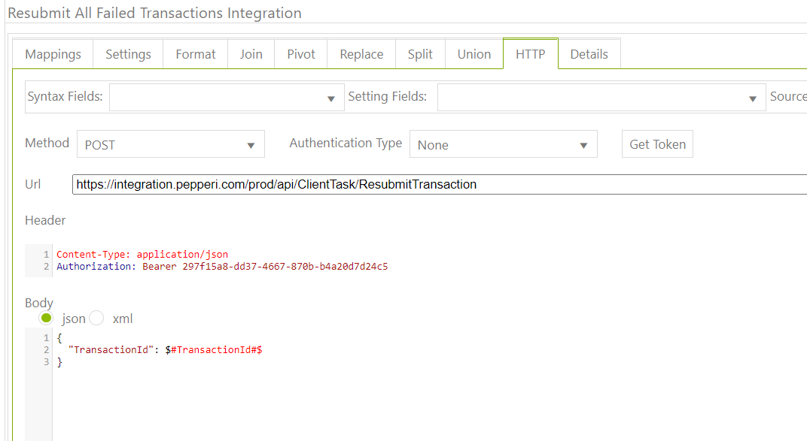

# Resubmit All Failed Transactions

Firstable you need to get all failed transactions (in separate task). After you have this csv with data , create a new one task, where privious task will be loop\_over\_table: 

.png>)

Then do this: 

