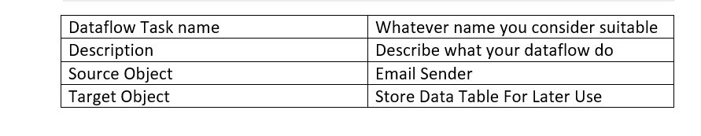
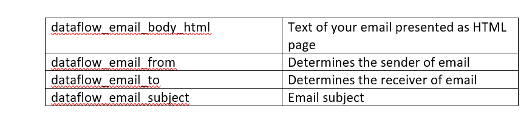
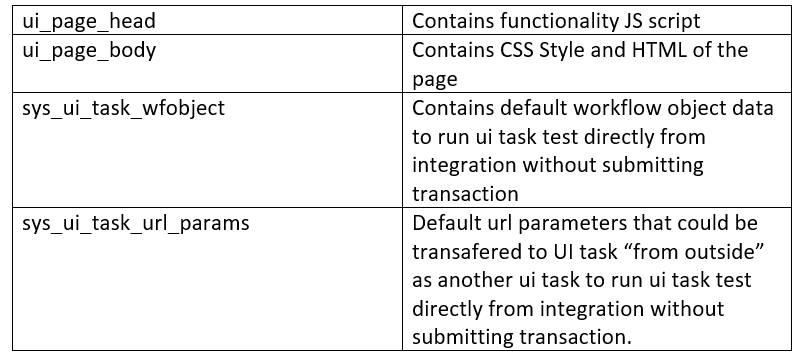
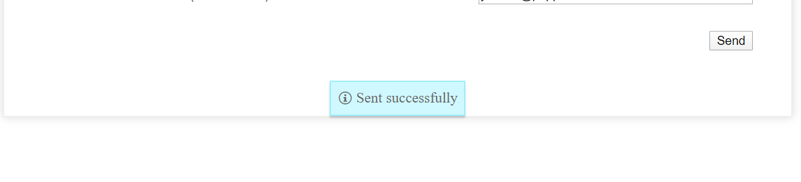

# Send email sequence for UI tasks

During you work with UI tasks you may face up the strong need to send some data to your client using email and bypassing common Workflow behavior. Lets say your client needs to receive the payment confirmation right after he had paid his order.&#x20;

_Note_: Commonly Email Senders use loop over table setting to retrieve the data from the system. In our case we can get rid of it, due to we transfer necessary data to email sender “on the go”, right within our UI task execution. First thing first you need to create an appropriate Email Sender Dataflow task.


&#x20;**Dataflow Task**
-----------------------

### **General Setting**

.png>)



### Advanced Dataflow Task Settings

.jpg>)




**dataflow\_email\_body\_html**. This setting contains general appearance of you email body. Use HTML to arrange the data.

Code snippet presented in Email Sender NO LOOP OVER TABLE dataflow task

[https://integration.pepperi.com/mgr/PluginSettings/ClientTask?TaskId=45183](https://integration.pepperi.com/mgr/PluginSettings/ClientTask?TaskId=45183)

**dataflow\_email\_from.** Contains email of the sender. Example describes usage of [integration@pepperi.com](mailto:integration@pepperi.com). You may use email of your client here or take it from your UI task by using variable format like \*\~email\~\* (will be described in UI task config part)

**dataflow\_email\_to.** Used to determine receiver email. In example presented as variable, taken from UI task.

**dataflow\_email\_subject.** Plain text email subject.&#x20;

### **UI task configuration**


You may find all code setup and setting by using provided example.

[https://integration.pepperi.com/mgr/PluginSettings/ClientTask?TaskId=45184](https://integration.pepperi.com/mgr/PluginSettings/ClientTask?TaskId=45184)

#### &#xD;**General settings**



### &#xD; **Functionality overview**

The main function which allows to launch email sender dataflow task from UI task looks like this:

```
function sender()
{
        get_data({
        //The name of the task (can be ui task or dataflow task).
        task_name:              'Email Sender NO LOOP OVER TABLE',                                
        //The method that will be called once get_data is done. 
        //The callback method data can be then parsed by ui_get_data_json (if defined) or the task CSV.
        success_callback:       'sendEmailCallback',                  
        //list of parameters to transfer to the dataflow task. After that data of parameter could be retreived
        //within dataflow task using syntax *~transaction_id~* and etc 
        post_array:             [{name:'transaction_id',value: transID},
                                 {name:'email',value: email},
                                 {name:'user_name',value: user_name}, 
                                ],
       
        });
}

```


The main technique to transfer data to our dataflow task is post\_array.

When carefully examine the code presented in the example’s ui\_page\_body setting, you will notice, that global variables

```
let transID, email, user_name; //global variables
```


firstly, assigned with textbox values

```
//function called onClick of the button
function sendEmail()
{
  //assign edit values to global variables
  transID = document.getElementById("input_1").value; 
  email = document.getElementById("input_3").value;
  user_name = document.getElementById("input_2").value;
  sender(); //call email sender
}
```


then used in name-value pairs of post\_array Object

```
post_array:                    [{name:'transaction_id',value: transID},
                                 {name:'email',value: email},
                                 {name:'user_name',value: user_name}, 
                                ],
       
        });
```


\
After that you can reach this values within the dataflow task using \*\~post\_array\_instance\_name\~\* syntax.

This approach used in dataflow\_email\_to setting

.png>)

and in dataflow\_email\_body

.png>)


&#x20;**How the example works**

Execute Send Email UI

.png>)

.png>)


\
Write your valid email into appropriate field. Note that test email will be send to email you wrote in this field so be careful.

.png>)


Press Send.

If you used valid email, you will be notified about successful execution.



Examine your mailbox

.png>)


