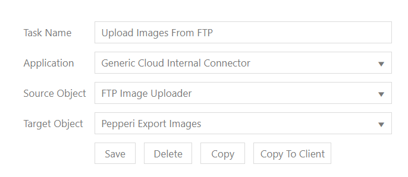
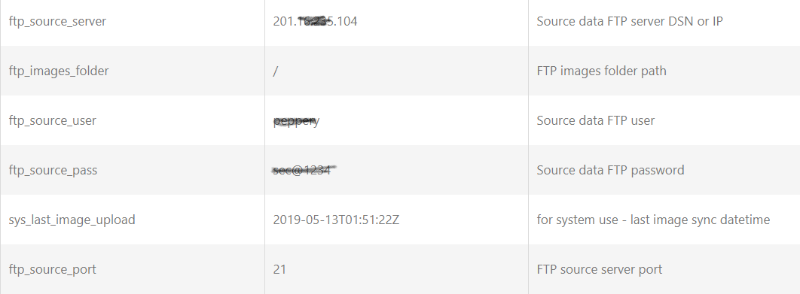

# Upload Images From FTP



create new dataflow task:




Define the following settings (on general - or per task)




**feature #1 : In case you want to upload image to different level (1-6)  you can name the file with underscore and the image level \<item id>\_1.jpg**

**feature #2 : you can change the image level separator which is by default underscore to other string using the settings field name:   `ftp_image_upload_level_seperator`**

**feature #3 : you can set the default image level using this settings field: `ftp_image_upload_level`**

**feature #4 : in case the images names are not the ExternalID of the item - you can do "join" with another task with any condition supported by the join tab and get the item ExternalID  - the image level can be used in combination with the join - and the file should contain at least 2 columns:**

1. `image_file_name  (the image name in the FTP folder)`
2. `item_id  (the item ExternalID)`

### file used for join:

.png>)

### ftp folder:

.png>)

### **join settings:**

.png>)





sy&#x73;_&#x6C;ast\_image\_upload  in settings  - is read only like other sys_ settings - it shows the last time all images were synced - only files with a newer date will be synced again


In this example is described Dataflow task 'Upload Images from FTP' in Integration Account 'Integration Examples'
