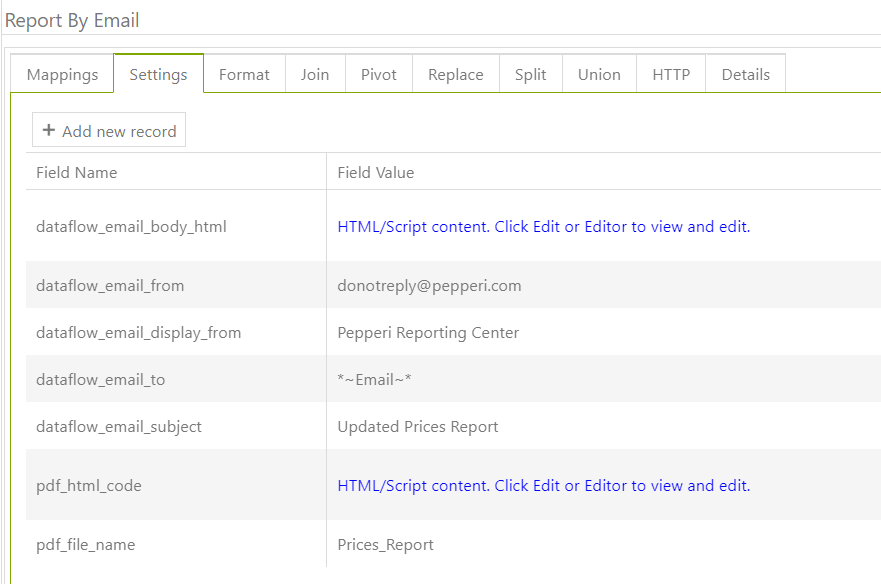
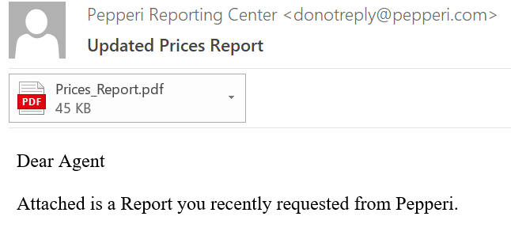
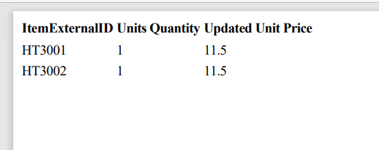

# UI - Getting started

This article describes an example that can give you a general understanding of the structure and functionality of the UI task and also some important nuances of using api functions, receiving data and sending data are considered.

**The task consists of:**&#x20;

1\. Use an api function that takes the fields of the lines of the current transaction;&#x20;

2\. Recalculate prices and update them using the api function;&#x20;

3\. Send updated data to the dataflow task that sends pdf to email with a notification about the updated data

#### First, let's look at how we can induce UI task

After you have created a UI task, click the "run" button, after this the following window will be available:

.png>)

Copy the left part (to which the arrow points) ---> create a custom form in the back office ---> paste the copied text into a custom form. Then you can call this task wherever you need it: in workflow, or, for example, in a program. In this example, the UI task will be called in the program that is in the cart.

**ui\_page\_head** - It is used to create javascript code. You can use also jQuery, Kendo;

**ui\_page\_body** - html+css

f**unction on\_load() {}** - in this function, you need to add a function that should be called when the UI task is called. In our case, we use an api function that will take lines from the current transaction:

```
<script>
    function on_load() {
        call_client_api({
            method_name: 'pepperi.api.transactionLines.search',
            request_object: {
                fields: ["UUID", "ItemExternalID", "UnitPrice"],
                filter: {
                    Operation: "AND",
                    LeftNode: {
                        ApiName: "Transaction.UUID",
                        Operation: "IsEqual",
                        Values: [wfobject.UUID]
                    },
                    RightNode: {
                        ApiName: "Hidden",
                        Operation: "IsEqual",
                        Values: ["false"]
                    }
                },

                pageSize: 100000,
                page: 1,
                responseCallback: "transactionLinesCallback",
            }
        });
    }

    function transactionLinesCallback(data) {
        console.log(data);
    }
</script>
```

Note that the syntax for api functions is slightly different from their usual form. And if you need use workflowObject , in UI task call it like **wfobject.**

.png>)

Using **get\_data(){}** you can call dataflow task. \
**task\_name** - name of Dataflow task

**post\_array** - data that you want to send

After finishing writing the code, create a dataflow task with the following settings:



**\*\~Email\~\* -**  this is way to call variable from post\_array

**pdf\_html\_code -** put here you data  \<div>\*\~data\~\*\</div>

After the completion of the UI task, you will receive the following email with the attachment:





You can add \<style>\</style> tags into **pdf\_html\_code and** style the table





