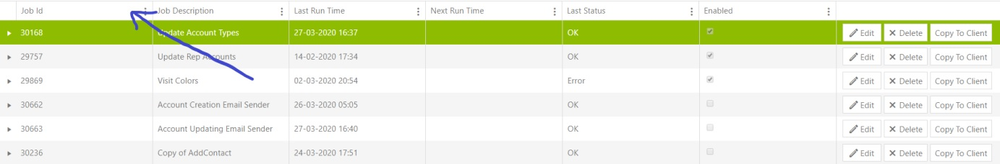
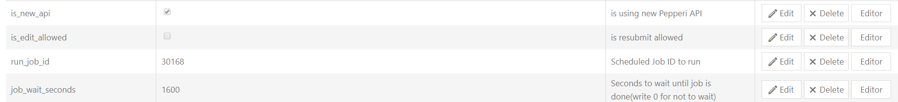

# Run job via webhook

For creating webhook wich triggers scheduled job you need id of this job. (Open schedule jobs and this menu is pop up, where you can find id column)

Create webhook with next settings :

 (1).png>)

After this you can use next setting :

After this webhook will trigger schedule job.

