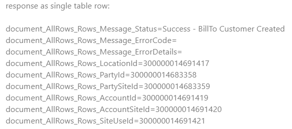
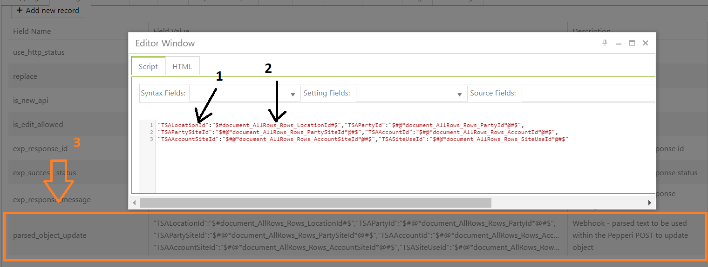
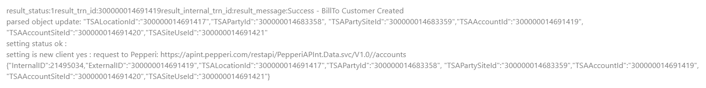

# Save values from customer response in Pepperi field

Suppose, we create a new account and the webhook sends a request to create this account in client's side. The webhook has completed successfully, and in the response we get some values that play a very important connecting role.

Example:

So, our goal is saving this values to TSA Fields for further use.

For this , we can use **parsed\_object\_update** setting:

where:

&#x20;3 - setting;

1 - name of TSA field in which value should be saved;

2 - value;

After adding this, we will se in the response and fields will be updated corresponding values:

