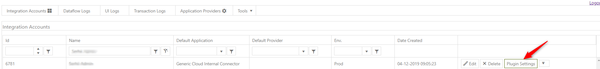

# How to set external id for accounts

ExternalID is External field - It should be created “ somewhere outside”. In such case we should create webhook and imitate action of creating ExternalID. It is necessary to send Post request that will “bring” ExternalID.

The first step is to make settings in Back-office: Settings –>Accounts –> Account types –> Customer(Edit) Then we should choose Workflow field:

.png>)

All action that is necessary to change is situated in Submitted to Submitted (you can see on image the final result). But it could be set in any other workflow branches In order to get ExternalID we will use TSANewAccountID field, but we should create it first (you can choose any other name for that field). Accounts –> Fields –> “+Add Fields”:

.png>)

Now we can come back to the previous step (Workflows): In Submitted to Submitted path we should create the logic.

.png>)

Also we should create Boolean field (red rhombus on image #3), let\`s name it TSAExecuteWebhook, it has Boolean value.

Account –> Fields –> “+Add Fields” –> CheckBox –> Create name for Field name –> Save

.png>)

Press edit (as on an image before) and add Branch. In Workflow we should create branch (“+Add” –> Branch Condition –> Select ExecuteWebhook; Choose submit to the 2nd field ).

.png>)

Branch division evaluates workflow to the status selected in case of true or false. The further code refers to TSAExecuteWebhook field and assign its status to true or false.


Now we can see Workflow,  as in the img3.

It is time to input code into 1st Action and create logic that in the case of true - gets ExternalID and in case of false - comes back to Submited. Code should be inserted into Custom form (our name – Accounts Webhook Validation), press + button and choose fields: TSANewAccountID and UUID.

To create, name and save Custom form press File:

.png>)

Choose – “Add new file”, write Name for a file and press Save button. Then inspect code below, that should be inserted into Custom form:

```
<!DOCTYPE html >
<html>
  <head>
  </head>
  <body>
  </body> 
  <script>

  var tmp;
 
  if (workflowObject.TSANewAccountID == "") {
 //if new TSANewAccountID field is empty, we assign varialbe tmp to 
 // false and it is updating TSAExecuteWebhook to false (as tmp value) 
 // and return to Submit
    tmp = false;
// update tmp status to ExecuteWebhook for exact UUID transaction
    pepperi.api.accounts.update({
      objects: [{ 
        UUID: workflowObject.UUID, 
        TSAExecuteWebhook: tmp }
      ],
      responseCallback: "Callb2"
    });
  }
 
  else {
     // in other case (not empty) we make a search 
TSANewAccountID == ExternalID  
    pepperi.api.accounts.search({
        fields: ["ExternalID"],
        filter: {
            ApiName: "ExternalID",
            Operation: "IsEqual",
            Values: [workflowObject.TSANewAccountID]
        },
        responseCallback: "Callb1"
    });
  }
  
    function Callb1(data) {
   // then check if data has values > 0, and if it is true, 
we assign tmp to true
    if (data.count > 0) {
      tmp = false;
    } else {
      tmp = true;
    }
    // last step is to update data with the true status
    pepperi.api.accounts.update({
      objects: [
        { UUID: workflowObject.UUID, TSAExecuteWebhook: tmp}
      ],
      responseCallback: "Callb2"
    });
  }
  function Callb2(data) {
    // {id: "0f6bf27d-90e0-4ea1-a76a-b3cf99a4dcde", status: "updated", message: ""}
/ refer to internal knowledge base, in case of success you should get the similar result
     onSaveAndClose()
  }
</script>
</html>
```

The next step is to add Actions and Branches on img4.

We should create new action with Webhook name, and once we open it – we should Enter the web service URL to be executed.

.png>)

Also in back-office we should add field (that we created earlier) –>NewAccountID. Account –> Account Types –> Forms –> Admin (or other profile) –> Edit and add field NewAccountID.


The next explanation will be about receiving URL.

1\.     Follow the link into your browser: integration.pepperi.com

2\.     Enter your name or name of your company into the Name fieldPress Pluging Settings button

3\. Press Plugin Settings button



4\. Manage Tasks –> Webhook tasks –> Add new task

.png>)

Add Task Name and fill in other fields and press Save.

5\. Webhook tasks – Choose the name of your task (for example, "Account ID Changing")

6\. We should fill data to Settings and HTTP fields.

6.1   In Settings – press Add new record button. Settings should contain “is\_edit\_allowed” and “is\_new\_api” fields.

6.2    In HTTP field we should choose Method: **POST** (webhook uses only POST request), than fill **URL** - !%new\_api\_base\_uri%!accounts (ID is based on account transaction),

**Header** - Authorization: {#client\_basic\_auth#}

X-Pepperi-ConsumerKey: {#consumer\_key#}

**Body** - {"InternalID": $#InternalID#$,

"ExternalID": "$#TSANewAccountID#$" }

Here we are looking for match of InternalID, and if find the match, we assign our field (we named it as TSANewAccountID) to ExternalID.

Last step – press Save button.

.png>)

7\. In Details field copy Commit Task URL. Come back to back-office, Settings ->Accounts-> Account Types –> Customer –> Workflow –> Edit (in our case Submit to Submit) –> Add –> Webhook –> paste URL into the first field –> Press Save.

Test it on a phablet, then in Integration platform choose Transaction Logs. Check status and press View Details button. NewAccountID in this file is equal to ExternalID. We created it manually and now assign one field to another. To force user fill in the NewAccountID field, change its status to Mandatory. Account Types –> Forms –> Edit (Admin or Rep or other profile) –>find NewAccountID field left and press “+”, then it will appear in right column –> choose it and put Mandatory.

.png>)
