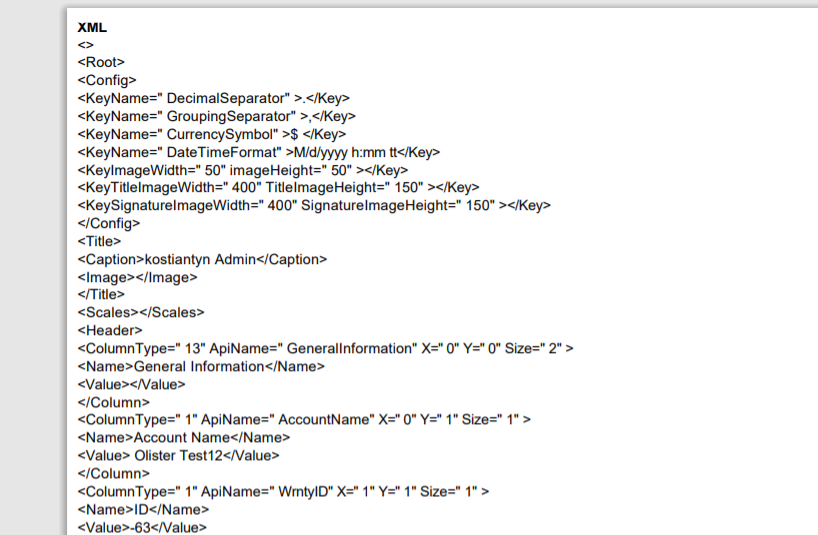

# Dynamic XSLT template - Get XML

Found this part in the code and change false() to true().

.png>)

Upload this file to the config files and create an order to check resulting  PDF:

This information will allow you to specifically determine the path to the data you need.
