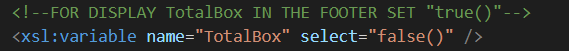
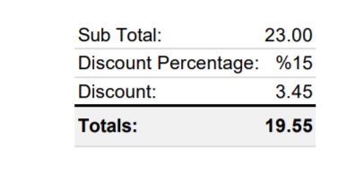

# Dynamic XSLT template - TotalBox

Best to use  TSA fields for footer totals , but if you want use TotalBox, then find this part of code and change false() to true(). (And , of course add TotalBox in PDF footer view in backoffice):

Result:

