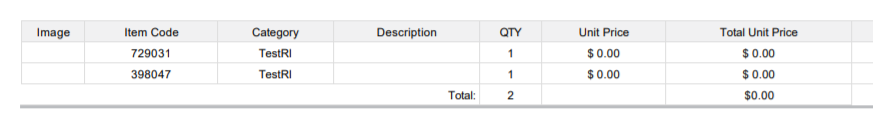

# Dynamic XSLT template - Filtering order table by parameter

Often there is a task to filter order lines by parameter.&#x20;

This example will show a filter by ItemMainCategory.

Original PDF:

.png>)

Found this part of code and uncomment what you need:

```
<xsl:for-each select="//Line[descendant::Column[@ApiName='UnitsQuantity']/Value &gt; 0 ] ">
                    <!-- FILTERING BY PARAMETER -->
                    <!--<xsl:if test="./Column[@ApiName='ItemMainCategory']/Value!='Hats'">-->
                    <tr>
                        <!--Values of the table-->
                        <xsl:for-each select="Column">
                            <!--HIDE column TSAExample-->
                            <!--<xsl:if test="@ApiName!='TSAExample'">-->
                            <!--SORTING BY PARAMETER-->
                            <!--<xsl:sort select="./Column[@ApiName='ItemExternalID']"/>-->
                            <xsl:choose>
                                <xsl:when test="@ApiName='Image'">
                                    <td>
                                        <xsl:attribute name="style">width:
                                            
                                            
                                            <xsl:value-of select="@width" />;
                                        
                                        
                                        </xsl:attribute>
                                        
                                            <xsl:attribute name="src">
                                                <xsl:variable name="imgURL"  select="substring-before(Value,'&amp;')"/>
                                                <xsl:value-of select="Value"/>
                                            </xsl:attribute>
                                        </img>
                                    </td>
                                </xsl:when>
                                <xsl:when test="@ApiName='UnitsQuantity'">
                                    <td>
                                        <xsl:value-of select='Value'/>
                                    </td>
                                </xsl:when>
                                <xsl:when test="@ApiName='TotalUnitsPriceAfterDiscount' or @ApiName='UnitPriceAfterDiscount' or @ApiName='UnitPrice'">
                                    <td >
                                        <xsl:variable name="last_part" select="substring(normalize-space(Value),string-length(normalize-space(Value))-2)"/>
                                        <xsl:variable name="first_part" select="substring-before(translate(Value,' ',''),$last_part)"/>
                                        <xsl:variable name="vals" select="concat(translate($first_part,',',''),translate($last_part,',','.'))"/>
                                        <xsl:if test="$DisplayCurrencyinLines='true'">
                                            <xsl:value-of select="concat($currency,format-number($vals, '###,##0.00'))"/>
                                        </xsl:if>
                                        <xsl:if test="$DisplayCurrencyinLines!='true'">
                                            <xsl:value-of select="format-number($vals, '###,##0.00')"/>
                                        </xsl:if>
                                    </td>
                                </xsl:when>
                                <xsl:otherwise>
                                    <td>
                                        <xsl:value-of select="Value" />
                                    </td>
                                </xsl:otherwise>
                            </xsl:choose>
                            <!--</xsl:if>-->
                        </xsl:for-each>
                    </tr>
                    <!--</xsl:if>-->
                </xsl:for-each>
```

in result should be:

```
<xsl:for-each select="//Line[descendant::Column[@ApiName='UnitsQuantity']/Value &gt; 0 ] ">
                    <!-- FILTERING BY PARAMETER -->
                    <xsl:if test="./Column[@ApiName='ItemMainCategory']/Value!='Hats'">
                    <tr>
                        <!--Values of the table-->
                        <xsl:for-each select="Column">
                            <!--HIDE column TSAExample-->
                            <!--<xsl:if test="@ApiName!='TSAExample'">-->
                            <!--SORTING BY PARAMETER-->
                            <!--<xsl:sort select="./Column[@ApiName='ItemExternalID']"/>-->
                            <xsl:choose>
                                <xsl:when test="@ApiName='Image'">
                                    <td>
                                        <xsl:attribute name="style">width:
                                            
                                            
                                            <xsl:value-of select="@width" />;
                                        
                                        
                                        </xsl:attribute>
                                        
                                            <xsl:attribute name="src">
                                                <xsl:variable name="imgURL"  select="substring-before(Value,'&amp;')"/>
                                                <xsl:value-of select="Value"/>
                                            </xsl:attribute>
                                        </img>
                                    </td>
                                </xsl:when>
                                <xsl:when test="@ApiName='UnitsQuantity'">
                                    <td>
                                        <xsl:value-of select='Value'/>
                                    </td>
                                </xsl:when>
                                <xsl:when test="@ApiName='TotalUnitsPriceAfterDiscount' or @ApiName='UnitPriceAfterDiscount' or @ApiName='UnitPrice'">
                                    <td >
                                        <xsl:variable name="last_part" select="substring(normalize-space(Value),string-length(normalize-space(Value))-2)"/>
                                        <xsl:variable name="first_part" select="substring-before(translate(Value,' ',''),$last_part)"/>
                                        <xsl:variable name="vals" select="concat(translate($first_part,',',''),translate($last_part,',','.'))"/>
                                        <xsl:if test="$DisplayCurrencyinLines='true'">
                                            <xsl:value-of select="concat($currency,format-number($vals, '###,##0.00'))"/>
                                        </xsl:if>
                                        <xsl:if test="$DisplayCurrencyinLines!='true'">
                                            <xsl:value-of select="format-number($vals, '###,##0.00')"/>
                                        </xsl:if>
                                    </td>
                                </xsl:when>
                                <xsl:otherwise>
                                    <td>
                                        <xsl:value-of select="Value" />
                                    </td>
                                </xsl:otherwise>
                            </xsl:choose>
                            <!--</xsl:if>-->
                        </xsl:for-each>
                    </tr>
                    </xsl:if>
                </xsl:for-each>
```

than found this code and uncomment. Here we need to do it bucouse if not , qty in subtotals will be wrong

```
  <xsl:for-each select = "//Line" >
                    <!--FILTERING BY PARAMETER-->
                    <!--<xsl:if test="./Column[@ApiName='ItemMainCategory']/Value!='Hats'">-->
                    <xsl:for-each select = "Column[@ApiName='UnitsQuantity']" >
                        <xsl:if test="Value != '' and Value &gt; 0 ">
                            arr.push(Math.abs("<xsl:value-of select='Value'/>")); 
                        </xsl:if>
                    </xsl:for-each>
                    <!-- </xsl:if>-->
                </xsl:for-each>
```

result:

```
 <xsl:for-each select = "//Line" >
                    <!--FILTERING BY PARAMETER-->
                    <xsl:if test="./Column[@ApiName='ItemMainCategory']/Value!='Hats'">
                    <xsl:for-each select = "Column[@ApiName='UnitsQuantity']" >
                        <xsl:if test="Value != '' and Value &gt; 0 ">
                            arr.push(Math.abs("<xsl:value-of select='Value'/>")); 
                        </xsl:if>
                    </xsl:for-each>
                    </xsl:if>
                </xsl:for-each>
```

To remove row with value 'Hats' of ItemMainCategory field from price SubTotal - found code and uncomment:

```
 <xsl:for-each select = "//Line" >
                    <!-- <xsl:if test="./Column[@ApiName='ItemMainCategory']/Value!='Hats'">-->
                    <xsl:for-each select = "Column[@ApiName='TotalUnitsPriceAfterDiscount']" >
                        <xsl:if test="Value != ''">
                            arr.push("<xsl:value-of select='Value'/>");
                        </xsl:if>
                    </xsl:for-each>
                    <!-- </xsl:if>-->
                </xsl:for-each>
                <!--</xsl:for-each>-->
```

result:

```
<xsl:for-each select = "//Line" >
                     <xsl:if test="./Column[@ApiName='ItemMainCategory']/Value!='Hats'">
                    <xsl:for-each select = "Column[@ApiName='TotalUnitsPriceAfterDiscount']" >
                        <xsl:if test="Value != ''">
                            arr.push("<xsl:value-of select='Value'/>");
                        </xsl:if>
                    </xsl:for-each>
                     </xsl:if>
                </xsl:for-each>
```

After uploading this template you will get a filtered order- table with correct SubTotals:


