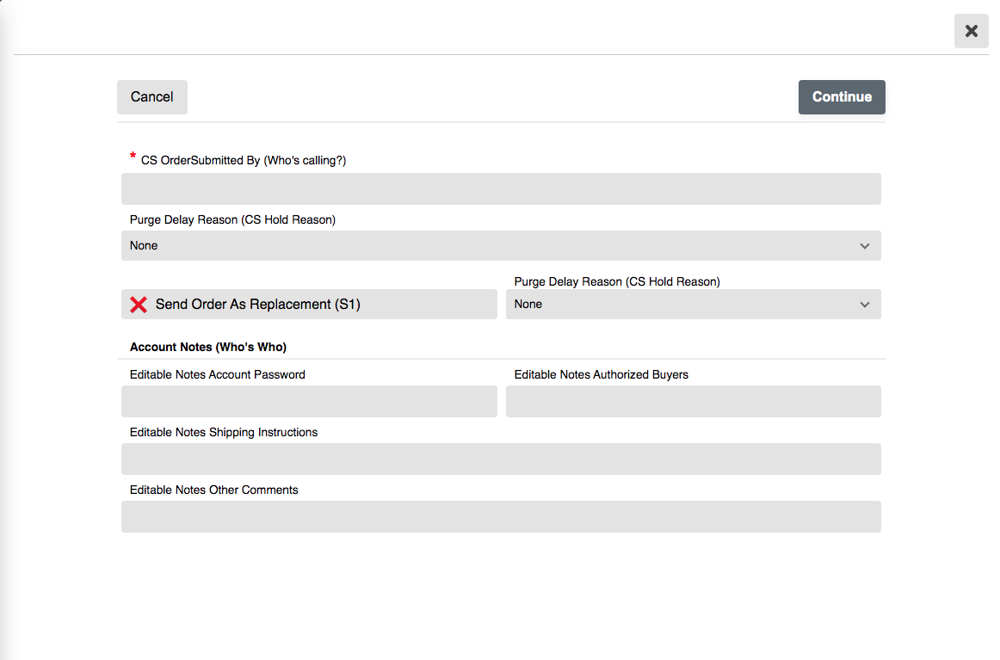
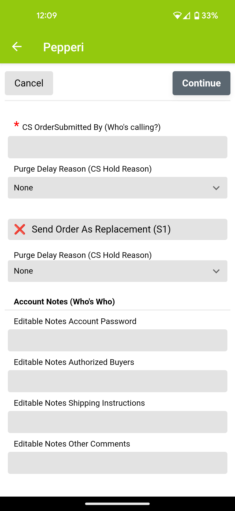

# Custom Order Details



By this form you can update the fields from transaction before submitting it. There is not a lot of code here, so it will not be difficult to modify it for your needs. here is the template that you can insert in yor code:

```javascript
//part of settings
var globalData={
        cfContext: [],
        fields:{},
        needFields: [ //fields what u wanna update/use
            "TSACSOrderSubmittedBy", 
            "TSACSHoldCode", 
            "TSASendOrderAsS1ToJDE",
            "TSAS1ReasonCode",
            "TSAEditableNotesAccountPassword",
            "TSAEditableNotesAuthorizedBuyers",
            "TSAEditableNotesShippingInstructions",
            "TSAEditableNotesOtherComments"
        ],
      };

//part where we get the fields 
pepperi.api.transactions.get({
          key: { UUID: globalData.cfContext.transaction.uuid },
          fields: [
            ...globalData.needFields
          ],
          responseCallback: "fieldsInsertToHtml"
      });

//Then code checks all values from transaction and inserts those to output HTML form:
const {
                TSACSOrderSubmittedBy,
                TSACSHoldCode,
                TSASendOrderAsS1ToJDE,
                TSAS1ReasonCode,
                TSAEditableNotesAccountPassword,
                TSAEditableNotesAuthorizedBuyers,
                TSAEditableNotesShippingInstructions,
                TSAEditableNotesOtherComments,
            } = globalData.fields;

            cSOrderSubmittedBy.value = TSACSOrderSubmittedBy;
            cSHoldCode.innerHTML = TSACSHoldCode;
            addBoolFromField(TSASendOrderAsS1ToJDE);
            s1ReasonCode.innerHTML = TSAS1ReasonCode;
            editableNAccPass.value = TSAEditableNotesAccountPassword;
            editableNAuthBuyers.value = TSAEditableNotesAuthorizedBuyers;
            editableNShipInst.value = TSAEditableNotesShippingInstructions;
            editableNOthrComments.value = TSAEditableNotesOtherComments;

```

The entered values will be substituted in the fields earlier, and if they are not there, the form will be empty.&#x20;

The view in Browser:

<figure><figcaption></figcaption></figure>

Mobile view:



<pre><code><strong>//There in HTML we have two types of lines for input fields: 
</strong>&#x3C;div class="type_single">&#x3C;/div>
&#x3C;div class="type_double">&#x3C;/div>
U can use that for yr custom templates.

<strong>//After all manipulation we just have button “Continue” what update transaction 
</strong><strong>//fields in this code:
</strong>function updateDetails(){
        if(cSOrderSubmittedBy.value == ''){
          cSOrderSubmittedBy.classList.add('warn'); //that just for important/mandatory field
        } else {
          try{
            cSOrderSubmittedBy.classList.remove('warn');
            pepperi.api.transactions.update({
              objects: [{
                UUID: globalData.cfContext.transaction.uuid,  //UUID transaction and other fields to update
                TSACSOrderSubmittedBy: cSOrderSubmittedBy.value,
                TSACSHoldCode: cSHoldCode.outerText,
                TSASendOrderAsS1ToJDE: !checkVal,
                TSAS1ReasonCode: s1ReasonCode.outerText,
                TSAEditableNotesAccountPassword: editableNAccPass.value,
                TSAEditableNotesAuthorizedBuyers: editableNAuthBuyers.value,
                TSAEditableNotesShippingInstructions: editableNShipInst.value, 
                TSAEditableNotesOtherComments: editableNOthrComments.value 
              }]
            });
            console.log('Updated');
            window.pepperiApp.onClose();
          } catch(e) {
            console.log('not updated(');
          }
        }
      };

//This template has comments for part of code. I think that easy for understand. 

</code></pre>
