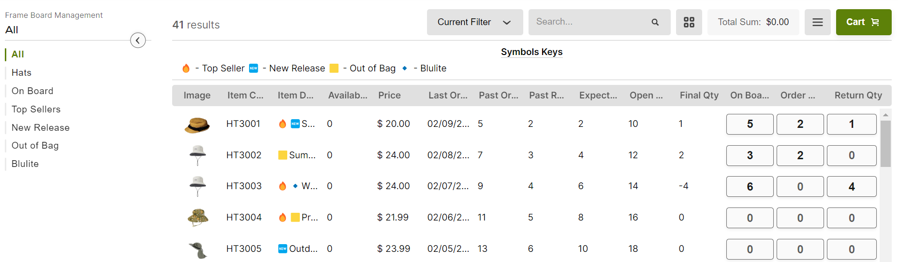

# Frame Board Management

## **Description**

Frame Board Management is a feature that allows you to place or remove items from the showcase and into the customer ERP system. Or instead, you can split the order and create a Sales Order and Return transaction, from the items that customer selected in the Frame Board Management transaction.

<figure><figcaption></figcaption></figure>

## **Advantages and disadvantages**


Frame Board Management works fast and allows customers to see and manage all of their items in one place.



If you have a requirement to split FBM transaction on Sales Order and Return transaction, it doesn\`t require internet connection - allows to create orders in the way when customer can see them immediately.



Open/Expected/Returned/Ordered Qtys and Last Order Date – won’t be updated instantly after submission, because they are using UDTs to get data from. UDTs should be always updated from the customer ERP system.



It will have the same disadvantages in case of using Split Order with Frame Board Management.


## **Demo - How does it work**

1\.     Open **Frame Board Management** transaction and select any customer.

2\.     Change On Board, Order Qty, Return Qty of items, this will add them to the cart.

3\.     Submit the order. This action could have 2 outcomes.

&#x20;            a.     Set data to customer ERP system, using webhooks

&#x20;            b.    Create a separate Sales Order and Return transactions in Pepperi. You can see them in the activity list.

## **How to copy to another environment**

First, you need to make a preparation, before setup a Frame Board Management.

### **Items**

Create this fields on items level. Type should be ‘Checkbox’.

·         TSAIsTopSeller

·         TSAIsNewRelease

·         TSAIsOutofBag

·         TSAIsBlulite

### **UDTs**

Create a UDTs that will work only with Frame Board Management. They should be having this settings: MainKey - AccountExternalID, SecondaryKey – Any.

·         FBM Open Qty

·         FBM Expected Qty

·         FBM Ordered Qty

·         FBM Returned Qty

·         FBM Last Order Items Date

### **Setup**

1\.     Create **Frame Board Management** transaction and the following fields:

<table data-header-hidden><thead><tr><th width="208"></th><th width="223.33333333333331"></th><th></th></tr></thead><tbody><tr><td><strong>Header Level</strong></td><td></td><td></td></tr><tr><td>Field Name</td><td>Field Type</td><td>Description</td></tr><tr><td>Header Calculation Init</td><td>Single Line Text (Calculated Field) – Always (Temporary)</td><td>
Get data from all FBM UDTs and set in this variables.

Set <strong>TSASymbolsKeysBanner</strong> field as hardcoded text.

<strong>this.calcTotalSum</strong> is recalculating total sum of the order.
</td></tr><tr><td>Header Calculation Change</td><td>Single Line Text (Calculated Field) – On Change</td><td>
Run <strong>this.calcTotalSum</strong> from Header Calculation Init field.

Triggered when one of the following fields changes: <strong>TSATriggerOnBoardChange</strong>, <strong>TSATriggerOnOrderQtyChange</strong>, <strong>TSATriggerOnReturnQtyChange</strong>.
</td></tr><tr><td>Symbols Keys Banner</td><td>Single Line Text</td><td>Contains a description of the symbol keys.</td></tr><tr><td>Total Sum</td><td>Currency</td><td>Contains total sum of the order.</td></tr><tr><td>Trigger On Board Change</td><td>Sum Transaction Lines</td><td>Sum of <strong>TSAOnBoard</strong> line field to trigger Header Calculation Change field.</td></tr><tr><td>Trigger On Order Qty Change</td><td>Sum Transaction Lines</td><td>Sum of <strong>TSAOrderQty</strong> line field to trigger Header Calculation Change field.</td></tr><tr><td>Trigger On Return Qty Change</td><td>Sum Transaction Lines</td><td>Sum of <strong>TSAReturnQty</strong> line field to trigger Header Calculation Change field.</td></tr></tbody></table>

&#x20;

| **Line Level**           |                                                          |                                                                                                                                                                                                                                                                                                                                                                                                                                                                                                                                                                                                                                                                                                                                                                               |
| ------------------------ | -------------------------------------------------------- | ----------------------------------------------------------------------------------------------------------------------------------------------------------------------------------------------------------------------------------------------------------------------------------------------------------------------------------------------------------------------------------------------------------------------------------------------------------------------------------------------------------------------------------------------------------------------------------------------------------------------------------------------------------------------------------------------------------------------------------------------------------------------------- |
| Field Name               | Field Type                                               | Description                                                                                                                                                                                                                                                                                                                                                                                                                                                                                                                                                                                                                                                                                                                                                                   |
| Lines Calculation Init   | Single Line Text (Calculated Field) – Always (Temporary) | 
Set data from this UDT variables, to following fields: <strong>TSAOpenQty</strong>,

<strong>TSAExpectedQty</strong>, <strong>TSAPastOrderedQty</strong>, <strong>TSAPastReturnedQty</strong>, <strong>TSALastOrderedDate</strong>.

Set <strong>TSAItemDescription</strong> based on following item fields:

<strong>ItemTSAIsTopSeller</strong>, <strong>ItemTSAIsNewRelease</strong>, <strong>ItemTSAIsOutofBag</strong>, ItemTSAIsBlulite.

<strong>this.calcFinalQty</strong> is calculating the final qty, based on <strong>TSAOrderQty</strong> – <strong>TSAReturnQty</strong>.

<strong>this.calcTotalPrice</strong> is calculating the total price of the line, based on <strong>UnitPrice</strong> * <strong>TSAFinalQty</strong>.
 |
| Lines Calculation Change | Single Line Text (Calculated Field) – On Change          | 
Run <strong>this.calcFinalQty</strong> and <strong>this.calcTotalPrice</strong> from Lines  Calculation Init field.

Triggered when one of the following fields changes: <strong>TSAOnBoard</strong>,

<strong>TSAOrderQty</strong>,

<strong>TSAReturnQty</strong>.
                                                                                                                                                                                                                                                                                                                                                                                                                                                                                    |
| Item Description         | Single Line Text                                         | 
Contains default <strong>ItemName</strong> with following symbols at the start of the item name, based on this fields:

<strong>ItemTSAIsTopSeller</strong> – 🔥 symbol,

<strong>ItemTSAIsNewRelease</strong> - 🆕 symbol,

<strong>ItemTSAIsOutofBag</strong> - 🟨 symbol,

<strong>ItemTSAIsBlulite</strong> - 🔹 symbol.
                                                                                                                                                                                                                                                                                                                                                                                                                       |
| Open Qty                 | Number                                                   | Contains a qty number from FBM Open Qty UDT.                                                                                                                                                                                                                                                                                                                                                                                                                                                                                                                                                                                                                                                                                                                                  |
| Expected Qty             | Number                                                   | Contains a qty number from FBM Expected Qty UDT.                                                                                                                                                                                                                                                                                                                                                                                                                                                                                                                                                                                                                                                                                                                              |
| Past Ordered Qty         | Number                                                   | Contains a qty number from FBM Ordered Qty UDT.                                                                                                                                                                                                                                                                                                                                                                                                                                                                                                                                                                                                                                                                                                                               |
| Past Returned Qty        | Number                                                   | Contains a qty number from FBM Returned Qty UDT.                                                                                                                                                                                                                                                                                                                                                                                                                                                                                                                                                                                                                                                                                                                              |
| Last Ordered Date        | Date                                                     | Contains a date from FBM Last Order Items Date UDT.                                                                                                                                                                                                                                                                                                                                                                                                                                                                                                                                                                                                                                                                                                                           |
| On Board                 | Integer Quantity Selector                                | Input selector of On Board qty.                                                                                                                                                                                                                                                                                                                                                                                                                                                                                                                                                                                                                                                                                                                                               |
| Order Qty                | Integer Quantity Selector                                | Input selector of Order qty.                                                                                                                                                                                                                                                                                                                                                                                                                                                                                                                                                                                                                                                                                                                                                  |
| Return Qty               | Integer Quantity Selector                                | Input selector of Return qty.                                                                                                                                                                                                                                                                                                                                                                                                                                                                                                                                                                                                                                                                                                                                                 |
| Final Qty                | Number                                                   | The final qty, based on **TSAOrderQty** – **TSAReturnQty**.                                                                                                                                                                                                                                                                                                                                                                                                                                                                                                                                                                                                                                                                                                                   |
| Total Price              | Currency                                                 | The total price of the line, based on **UnitPrice** \* **TSAFinalQty**.                                                                                                                                                                                                                                                                                                                                                                                                                                                                                                                                                                                                                                                                                                       |
| Split Order Type Id      | Single Line Text                                         | 
Is array of the transactions for splitting order. Using data from <strong>FBM Split Order Parameters</strong> UDT.

Use only if you need to create a split orders in Pepperi.
                                                                                                                                                                                                                                                                                                                                                                                                                                                                                                                                                                                     |

&#x20;

2\.     Add webhooks to the workflow to update the data in the client ERP

3\.     Create **Frame Board Management** catalog and filters in following order:

a.     All – show all items

b.    Brands – show items grouped by brand (Dynamic filter)

c.     On Board – show items where **TSAExpectedQty** and **TSAOnBoard** > 0

d.    Top Sellers – show items where **ItemTSAIsTopSeller** is true

e.     New Release - show items where **ItemTSAIsNewRelease** is true

f.      Out of Bag - show items where **ItemTSAIsOutofBag** is true

g.    **Blulite** - show items where **ItemTSAIsBlulite** is true

#### **OR**

1\.     Export **Frame Board Management** from Services Demo Environment

2\.     Create **Frame Board Management** transaction and import a file from Services Demo Environment

3\.     Create **Frame Board Management** catalog and copy it from Services Demo Environment to your environment

### **Add Split Order logic to Frame Board Management**

1\.     Create a **FBM Sales Order** and **FBM Return** transactions for Frame Board Management, or you can use the transactions that you already have. Create a **TSAOriginalOrder** as a reference type to **Frame Board Management** transaction.

2\.     Create a **FBM Split Order Parameters** UDT. It should have MainKey, SecondaryKey as Any.

3\.     Add two records:

a.     MainKey – ‘Order’. Value – ‘_Name of Sales Order transaction_’.

b.    MainKey – ‘Return. Value – ‘_Name of Return transaction_’.

4\.     Create a **TSASplitOrderTypeId** as a Single Line Text in **Frame Board Management** transaction. Uncomment all code that using **this.FBMSplitOrderParamsUDT**.

5\.     Adding custom form splitter (can be copied from **Frame Board Management** transaction, workflow action In Creation -> Submitted)

6\.     In custom form, change **defaultCatalogName** variable, on catalog name, which new split transactions are to be created.

### **Disable Split Order logic**

1\.     Comment/remove all code that using this.FBMSplitOrderParamsUDT.

2\.     Remove **FBM Split Order Parameters** UDT

3\.     Remove custom form from workflow action in In Creation -> Submitted
