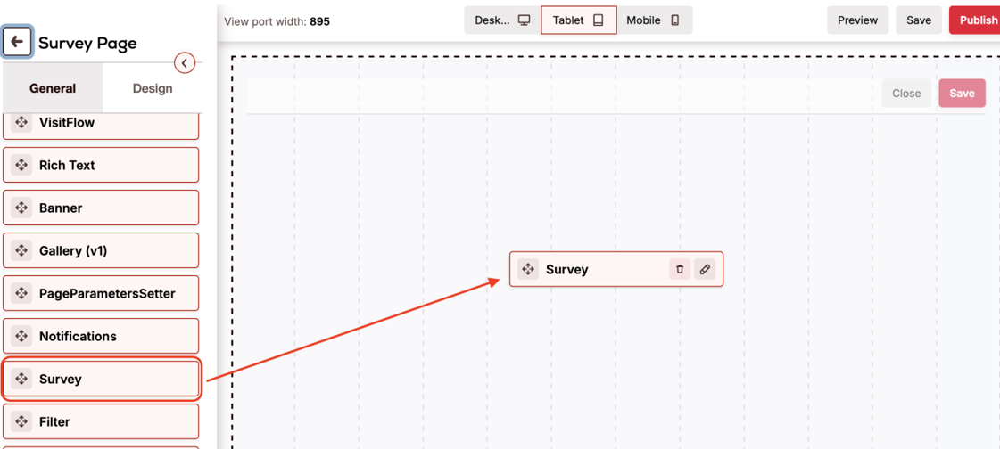
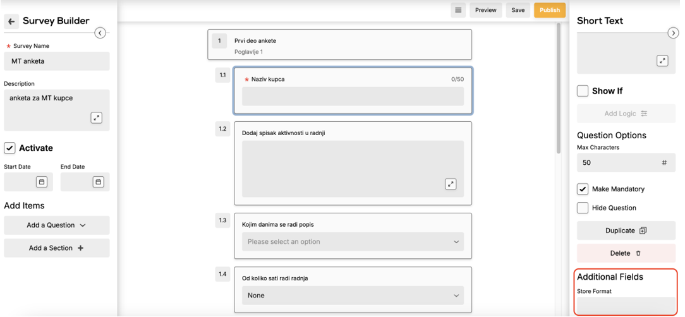

# Surveys Add-on

Survey is a new feature in Pepperi, which is presented with a fancy UI and allows to collect user answers into a UDC. It works best in pair with VisitFlow (https://kbint.pepperi.com/add-ons-manuals/pages-add-on/visit-flow-event).

## Required addons

* Survey - dd0a85ea-7ef0-4bc1-b14f-959e0372877a
* Survey Builder - cf17b569-1af4-45a9-aac5-99f23cae45d8


_Note:_ latest versions of survey builder requiere a bunch of dependencies, some of them may not be already installed e.g. Nebula, User Defined Collections, Abstract Activity, Scripts. Before installing these addons, please get the approval (especially for Nebula!)


Example of survey view for end user:

<figure><figcaption>
survey view
</figcaption></figure>

## How does it work:

1. There are 2 UDCs created after installing addon. First is MySurveyTemplates - it stores templates of a surveys which can be configured with backoffice. Second one is MySurveys, it stores surveys answers.
2. User triggers an action to open a survey: the best way is by clicking a step in VisitFlow, however you can open it using a flow from any page. This step creates a new record in MySurveys UDC.
3. User is navigated by slug to the page with survey view, you should pass a key of newly created record e.g. “surveys?survey\_key=xxx-xxx-xxx”. Survey onload event is triggered, it can run your script to additionally hide/filter questions if needed.
4. User answers the questions and can save or cancel the changes. In case of save, corresponding record in MySurveys UDC gets updated.

## How to setup

1. Install requiered addons.
2. Create relevant scripts. For basic workability you will need just one OnSurveyViewLoad script


On Survey View Load


3.  Assign scripts to relevant events. Those events can be found in MySurveys and MySurveyTemplates UDCs scheme editing pages:

    Edit schema of MySurveys and assign OnSurveyViewLoad  script to “OnSurveyFieldChange”, “OnSurveyQuestionChanged” and “OnSurveyViewLoad” events.

<figure><figcaption>
events
</figcaption></figure>

4. Create new page and add a survey block to it. Map this page to ‘surveys’ slug (create it if does not exist).

<figure><figcaption>
survey block
</figcaption></figure>

5. Create new template in backoffice (Settings -> Sales Acvivities -> Survey Builder (Beta)) and add some questions.
6. Now you can open a survey from VisitFlow or any custom page:

&#x20;       _6.1._ VisitFlow:

* Make sure your OnVisitFlowStepClick script handles survey creation. If not, refer to VisitFlows article to have a proper example.
* In visit configuration create new step and populate ‘Resource’ field with value ‘MySurveys’ and field ‘Resource Creation Data’ with template uuid. Step with a survey should appear in a visit, and you should now be able to open a survey from a visitflow.

&#x20;     _6.2._ Custom page:

* You need to assign a flow with script that will create a record in MySurveys udc and navigate to ‘surveys’ slug. Example of such script is attached


Create Survey And Navigate



_Note:_ Custom page approach may not work good for Reps on webapp due to how webapp connects accounts. To avoid this issue, make sure that this page is opened from account dashboard.



_Note_: use slug with name ‘surveys’ and pass ‘survey\_key’ param as these names are hardcoded in VisitFlow addon code.


## Survey Builder

Survey Builder can be accessed from Settings -> Sales Acvivities -> Survey Builder (Beta). There you can manage existing templates.

Except default settings and features you can create custom fields for your purposes (mainly for filtering) which called ‘Additional Fields’:

<figure><figcaption>
Additional Fields
</figcaption></figure>

To create such custom fields you will need:

1. Edit MySurveyTemplates UDC template in settings
2. 1\. Open events tab and add “_OnSurveyTemplateViewLoad_” event
3. Assign your script with custom fields


On Survey Builder Load


## Survey Report

Customer will probably want to have a survey report to get single file with all the answers. There is an example of tasks to start with, link to iPaaS tasks on Services Demo Environment:  [https://integration.pepperi.com/mgr/PluginSettings/ClientTask?TaskId=94885](https://integration.pepperi.com/mgr/PluginSettings/ClientTask?TaskId=94885)


_Note:_ changing existing survey template is not recommended as report will not properly include changes in the old survey answers.

