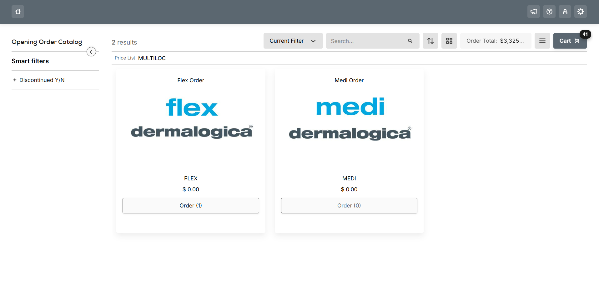

# BC Opening Orders

This transaction type fully consists of dedicated package promotions with ability to add only one to the cart. It allows users to choose the template of their order with specific item scope, workflow rules, item selection rules and validation.

<figure><figcaption>
Order Center
</figcaption></figure>

<figure><figcaption>
Cart
</figcaption></figure>

<figure><figcaption>
Single template in a cart validaiton
</figcaption></figure>
